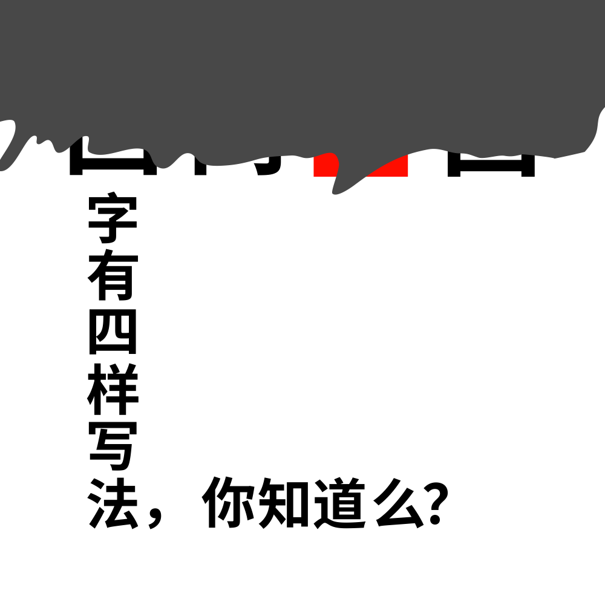

# 千字谜子题 923

## 题面

## 答案

`囬`

## 解析

回字的四种写法，容易联想到《孔乙己》中的名句。其中回、囘、囬三种写法比较常见。通过露出的部分分析可以推断红色部分是“囬”

## 本地附件

- [76443097204c4308af73dd81370cd80f.webp](../../../assets/static.cipherpuzzles.com/static/images/76443097204c4308af73dd81370cd80f.webp)

来源：[https://ccbc16.cipherpuzzles.com/data/c16-qian-puzzle.json#cid=923](https://ccbc16.cipherpuzzles.com/data/c16-qian-puzzle.json#cid=923)
