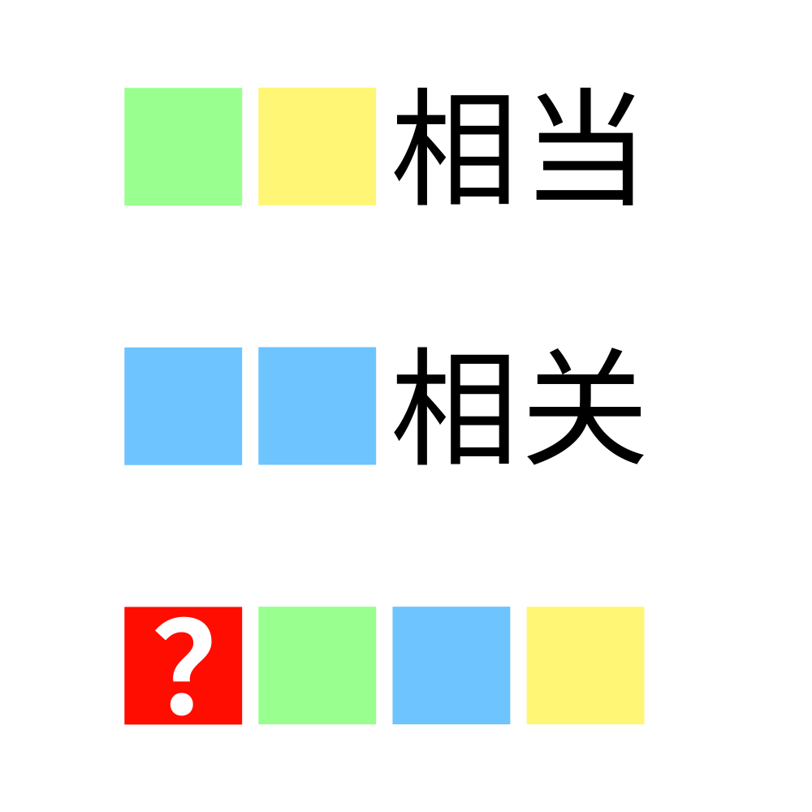

# 千字谜子题 925

## 题面

## 答案

`偃`

## 解析

将前两行补充为成语，得到“旗鼓相当”“息息相关”，将同颜色的方块对应地填入第三行，得到“？旗息鼓”，于是本题答案为“偃”

## 本地附件

- [5d2d1cedb47448cea5f93930da7fa1ba.webp](../../../assets/static.cipherpuzzles.com/static/images/5d2d1cedb47448cea5f93930da7fa1ba.webp)

来源：[https://ccbc16.cipherpuzzles.com/data/c16-qian-puzzle.json#cid=925](https://ccbc16.cipherpuzzles.com/data/c16-qian-puzzle.json#cid=925)
