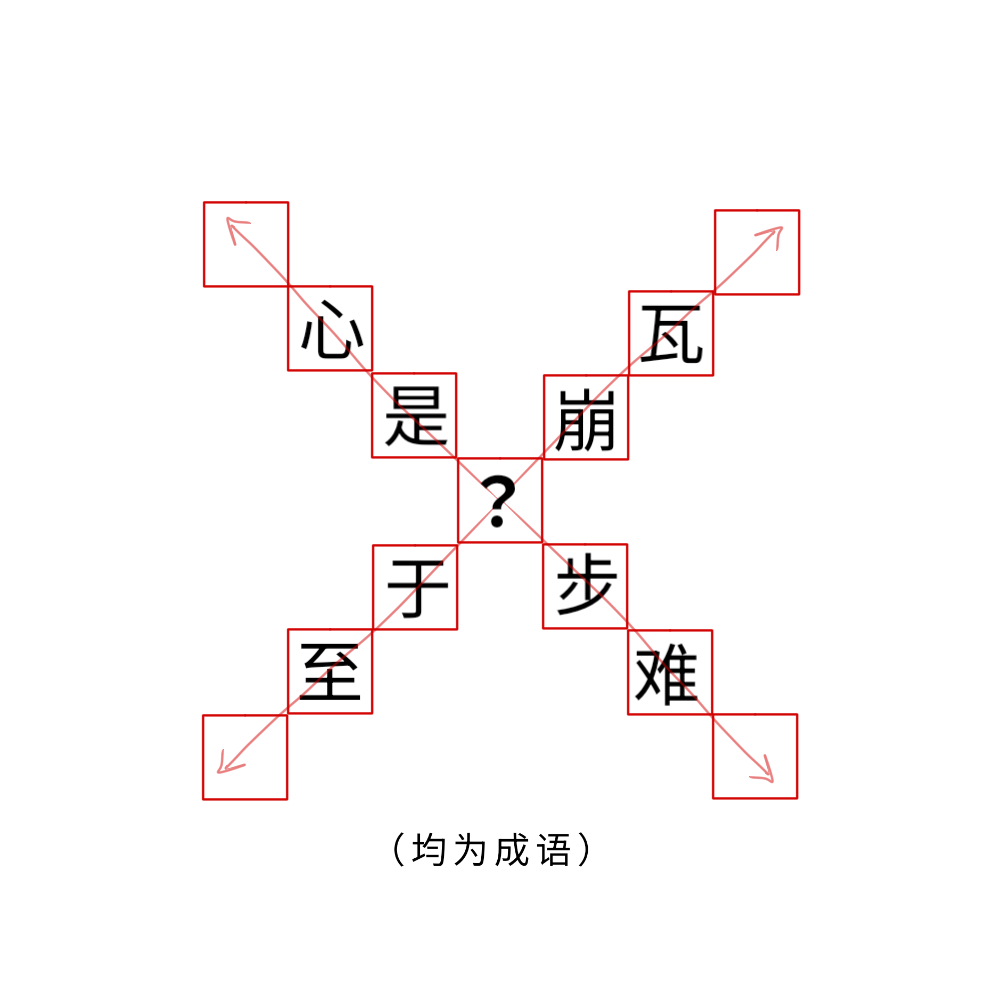

# 千字谜子题 927

## 题面

## 答案

`跱`

## 解析

口土
止寸

## 本地附件

- [cf12f78b09b94ef595dfc778128a1e40.webp](../../../assets/static.cipherpuzzles.com/static/images/cf12f78b09b94ef595dfc778128a1e40.webp)

来源：[https://ccbc16.cipherpuzzles.com/data/c16-qian-puzzle.json#cid=927](https://ccbc16.cipherpuzzles.com/data/c16-qian-puzzle.json#cid=927)
