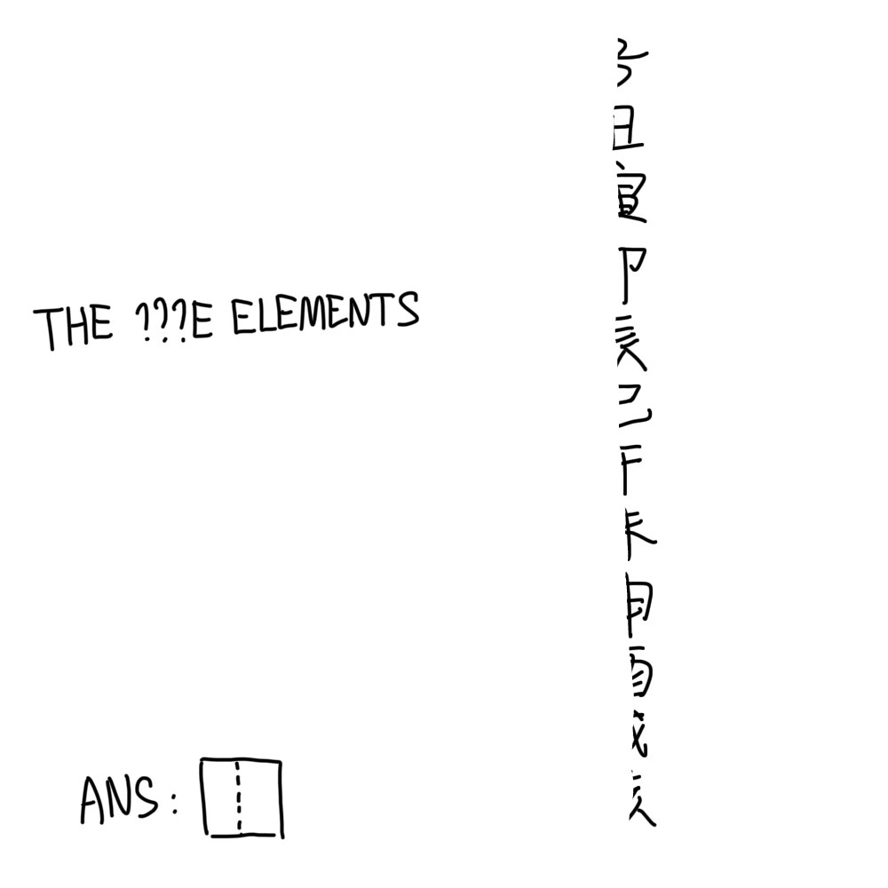

# 千字谜子题 93

## 题面

（八）

## 答案

`枝`

## 解析

左侧"the five elements"为五行，注意到恰好有15个字母且第4~6个字母替换成了问号，提取“金木水火土”中的第二个“木”；右侧为擦去了左边一半的地支，提取“地支”的“支”。将二者拼在一起得到答案“枝”。

## 本地附件

- [02070ca84ba64f28a1b3704205a856fb.webp](../../../assets/static.cipherpuzzles.com/static/images/02070ca84ba64f28a1b3704205a856fb.webp)

来源：[https://ccbc16.cipherpuzzles.com/data/c16-qian-puzzle.json#cid=93](https://ccbc16.cipherpuzzles.com/data/c16-qian-puzzle.json#cid=93)
