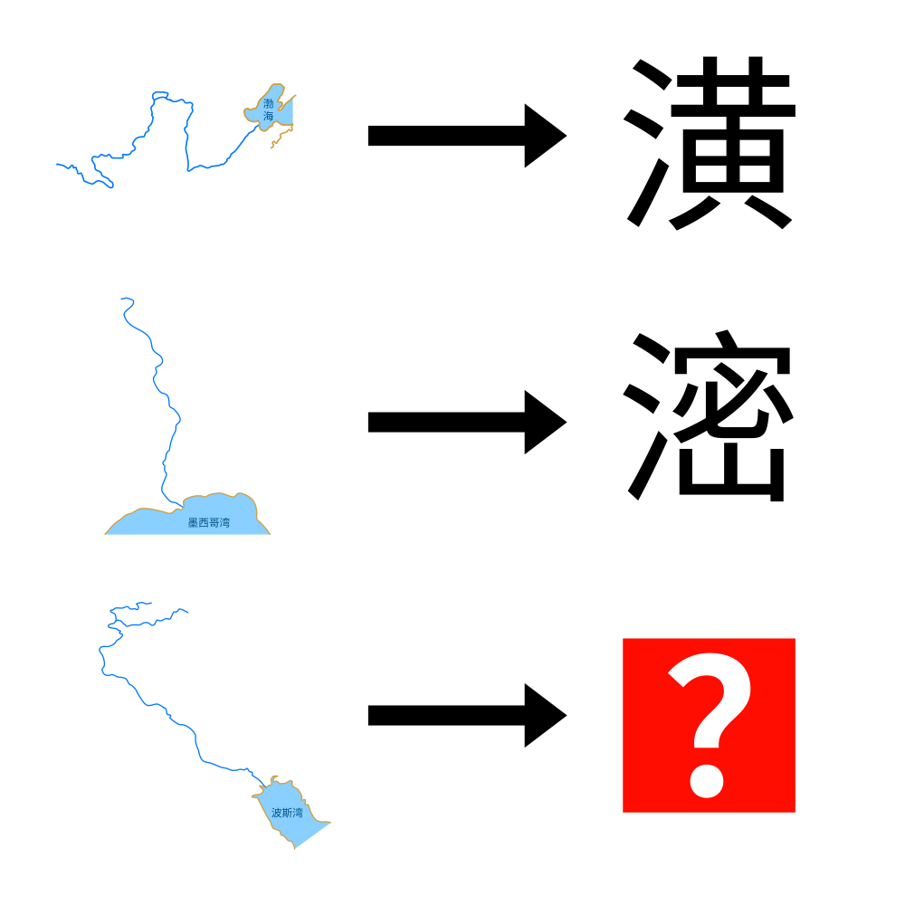

# 千字谜子题 931

## 题面

## 答案

`泑`

## 解析

适当观察和搜索可以得到左侧分别为黄河，密西西比河和幼发拉底河。于是得到箭头的变换规则为给河流名称的第一个字加上三点水，于是答案为泑

## 本地附件

- [a18ce90a990c49a1be1a7b3f46ae8728.webp](../../../assets/static.cipherpuzzles.com/static/images/a18ce90a990c49a1be1a7b3f46ae8728.webp)

来源：[https://ccbc16.cipherpuzzles.com/data/c16-qian-puzzle.json#cid=931](https://ccbc16.cipherpuzzles.com/data/c16-qian-puzzle.json#cid=931)
