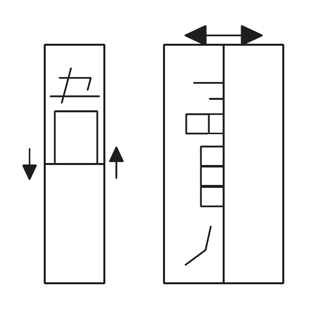

# 千字谜子题 932

## 题面

## 答案

`韥`

## 解析

_官方存档未填写解析。_

## 本地附件

- [09c0f2dee76d4cf29c10e7fe20f60fae.webp](../../../assets/static.cipherpuzzles.com/static/images/09c0f2dee76d4cf29c10e7fe20f60fae.webp)

来源：[https://ccbc16.cipherpuzzles.com/data/c16-qian-puzzle.json#cid=932](https://ccbc16.cipherpuzzles.com/data/c16-qian-puzzle.json#cid=932)
