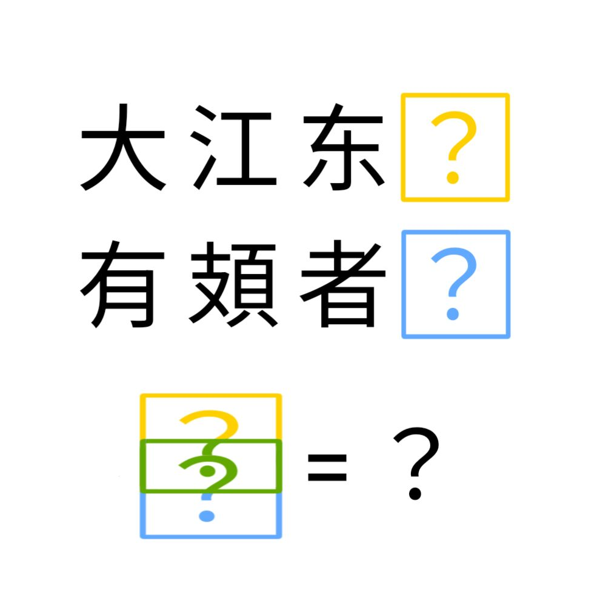

# 千字谜子题 933

## 题面

## 答案

`弆`

## 解析

_官方存档未填写解析。_

## 本地附件

- [6a032fb6bd744d1fbbf16e0b85c1325e.webp](../../../assets/static.cipherpuzzles.com/static/images/6a032fb6bd744d1fbbf16e0b85c1325e.webp)

来源：[https://ccbc16.cipherpuzzles.com/data/c16-qian-puzzle.json#cid=933](https://ccbc16.cipherpuzzles.com/data/c16-qian-puzzle.json#cid=933)
