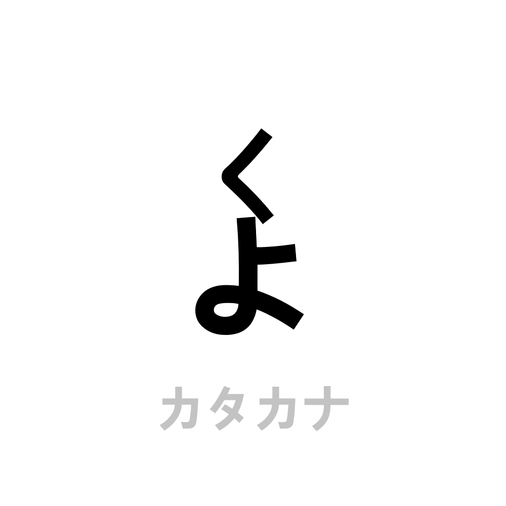

# 千字谜子题 935

## 题面

## 答案

`刍`

## 解析

灰色字体的カタカナ提示将く和よ转换成片假名为ク和ヨ，上下拼字得答案为“刍”。

## 本地附件

- [6f43a3a7ce23438999a2c612a306745b.webp](../../../assets/static.cipherpuzzles.com/static/images/6f43a3a7ce23438999a2c612a306745b.webp)

来源：[https://ccbc16.cipherpuzzles.com/data/c16-qian-puzzle.json#cid=935](https://ccbc16.cipherpuzzles.com/data/c16-qian-puzzle.json#cid=935)
