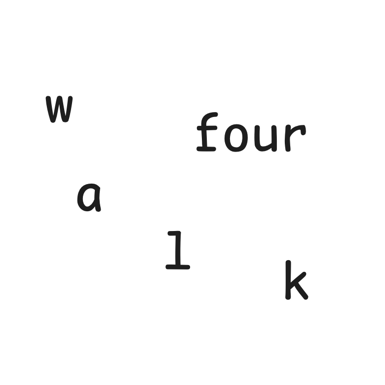

# 千字谜子题 936

## 题面

## 答案

`赳`

## 解析

_官方存档未填写解析。_

## 本地附件

- [26f78beae23b4c2793764ac71dcd4b59.webp](../../../assets/static.cipherpuzzles.com/static/images/26f78beae23b4c2793764ac71dcd4b59.webp)

来源：[https://ccbc16.cipherpuzzles.com/data/c16-qian-puzzle.json#cid=936](https://ccbc16.cipherpuzzles.com/data/c16-qian-puzzle.json#cid=936)
