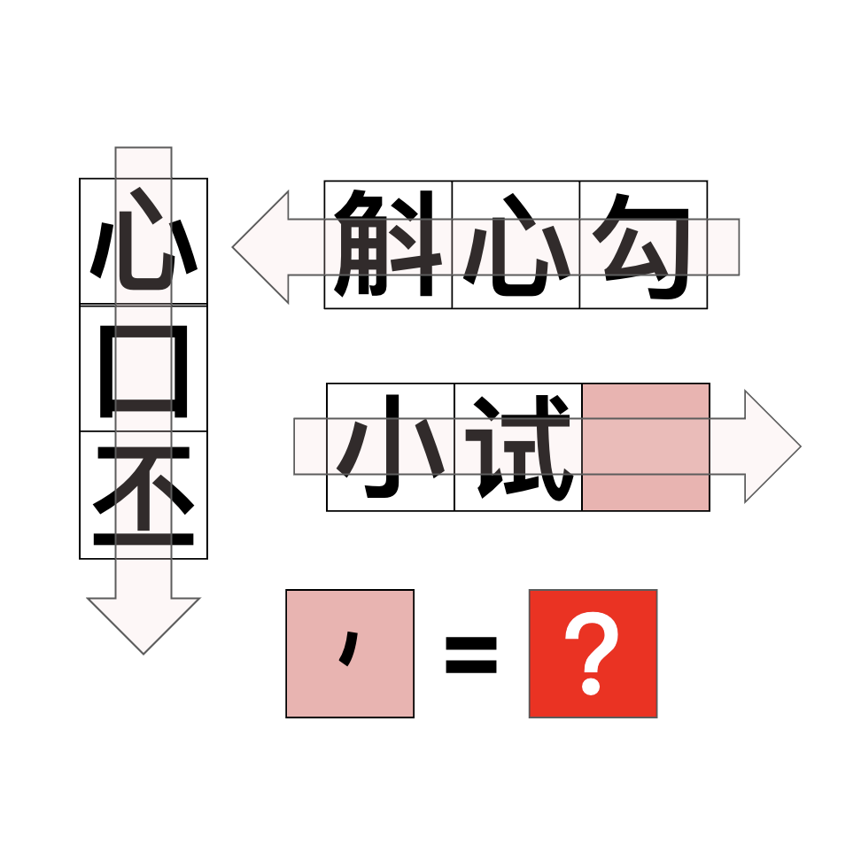

# 千字谜子题 939

## 题面

## 答案

`牣`

## 解析

三则成语按箭头方向读分别为“心口不一”“勾心斗角”“小试牛刀”，其中“不一”合为“丕”，“斗角”合为“斛”，“牛刀”和一撇合为“牣”。

## 本地附件

- [bfad048c1d7a44f3bffd14ca13b522f1.webp](../../../assets/static.cipherpuzzles.com/static/images/bfad048c1d7a44f3bffd14ca13b522f1.webp)

来源：[https://ccbc16.cipherpuzzles.com/data/c16-qian-puzzle.json#cid=939](https://ccbc16.cipherpuzzles.com/data/c16-qian-puzzle.json#cid=939)
