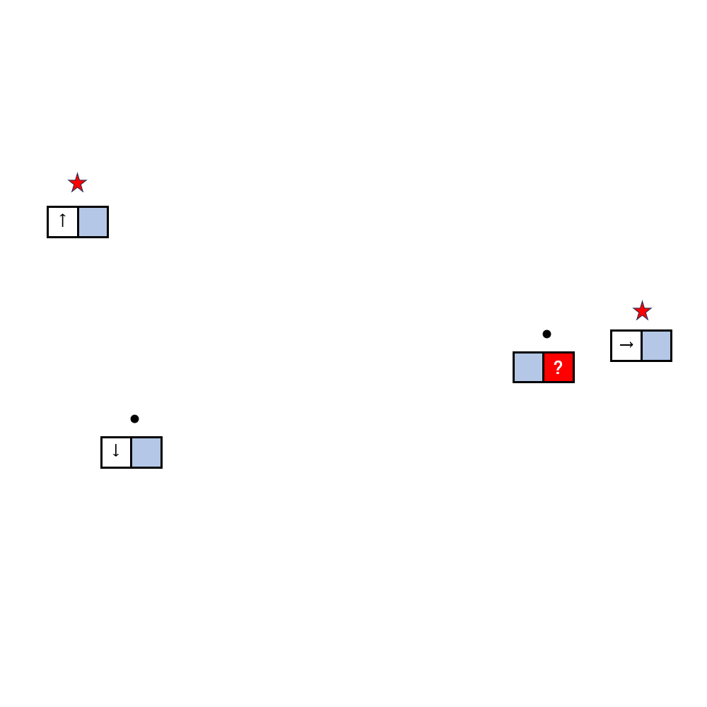

# 千字谜子题 94

## 题面

## 答案

`都`

## 解析

北京，南京，东京，京都

## 本地附件

- [f3236975d271475c98d607856c7582f4.webp](../../../assets/static.cipherpuzzles.com/static/images/f3236975d271475c98d607856c7582f4.webp)

来源：[https://ccbc16.cipherpuzzles.com/data/c16-qian-puzzle.json#cid=94](https://ccbc16.cipherpuzzles.com/data/c16-qian-puzzle.json#cid=94)
