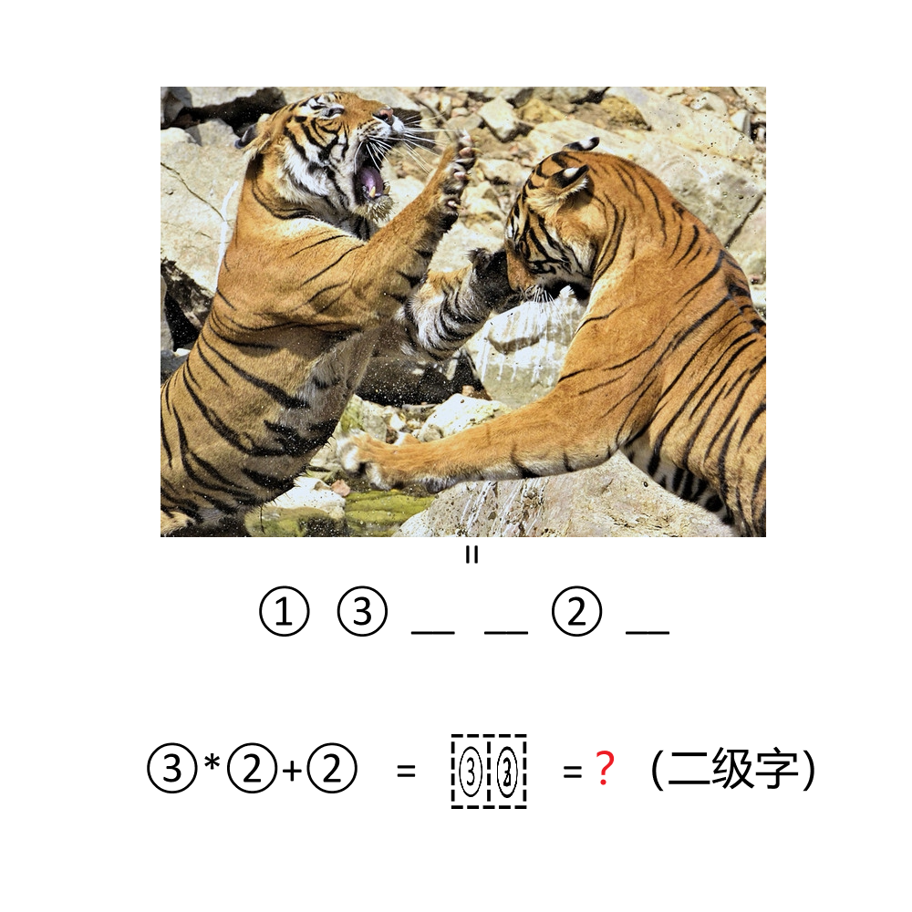

# 千字谜子题 943

## 题面

## 答案

`岫`

## 解析

理解图，“两只老虎争斗”对应六字俗语“一山不容二虎”，“山”和“二”字按下方要求组字得到答案“岫”

## 本地附件

- [be793d03775540c5a315243d5c5b454d.webp](../../../assets/static.cipherpuzzles.com/static/images/be793d03775540c5a315243d5c5b454d.webp)

来源：[https://ccbc16.cipherpuzzles.com/data/c16-qian-puzzle.json#cid=943](https://ccbc16.cipherpuzzles.com/data/c16-qian-puzzle.json#cid=943)
