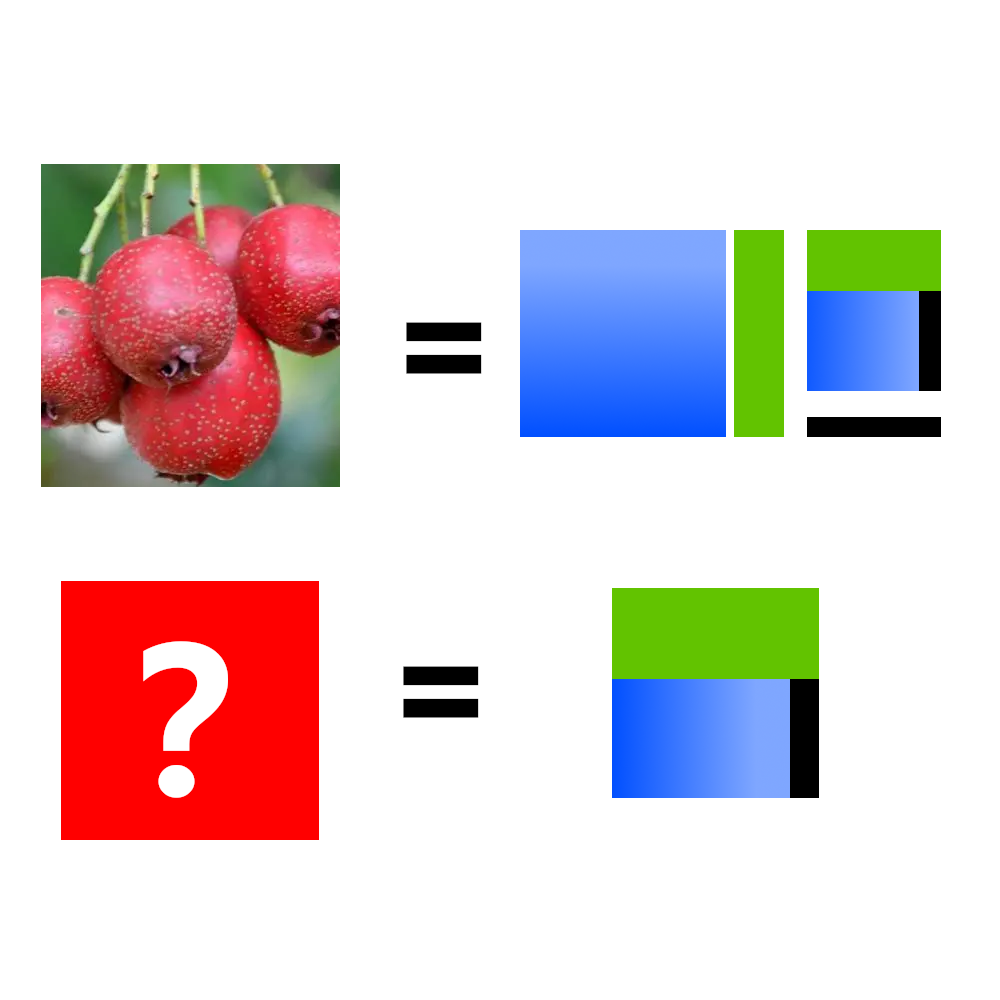

# 千字谜子题 944

## 题面

## 答案

`杳`

## 解析

_官方存档未填写解析。_

## 本地附件

- [8a89ac6a7b464a08bf97d04caff2fa9b.webp](../../../assets/static.cipherpuzzles.com/static/images/8a89ac6a7b464a08bf97d04caff2fa9b.webp)

来源：[https://ccbc16.cipherpuzzles.com/data/c16-qian-puzzle.json#cid=944](https://ccbc16.cipherpuzzles.com/data/c16-qian-puzzle.json#cid=944)
