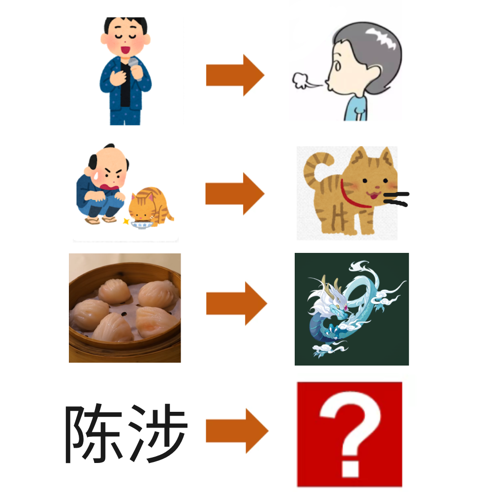

# 千字谜子题 946

## 题面

## 答案

`陟`

## 解析

唱歌→吹，喂猫→喵，虾饺→蛟，陈涉→陟。取左字的左半边部分以及右字的右半边部分，得到答案。（PS：作者的id  物持→特）

## 本地附件

- [88e8519d478c4d869b801376cc212457.webp](../../../assets/static.cipherpuzzles.com/static/images/88e8519d478c4d869b801376cc212457.webp)

来源：[https://ccbc16.cipherpuzzles.com/data/c16-qian-puzzle.json#cid=946](https://ccbc16.cipherpuzzles.com/data/c16-qian-puzzle.json#cid=946)
