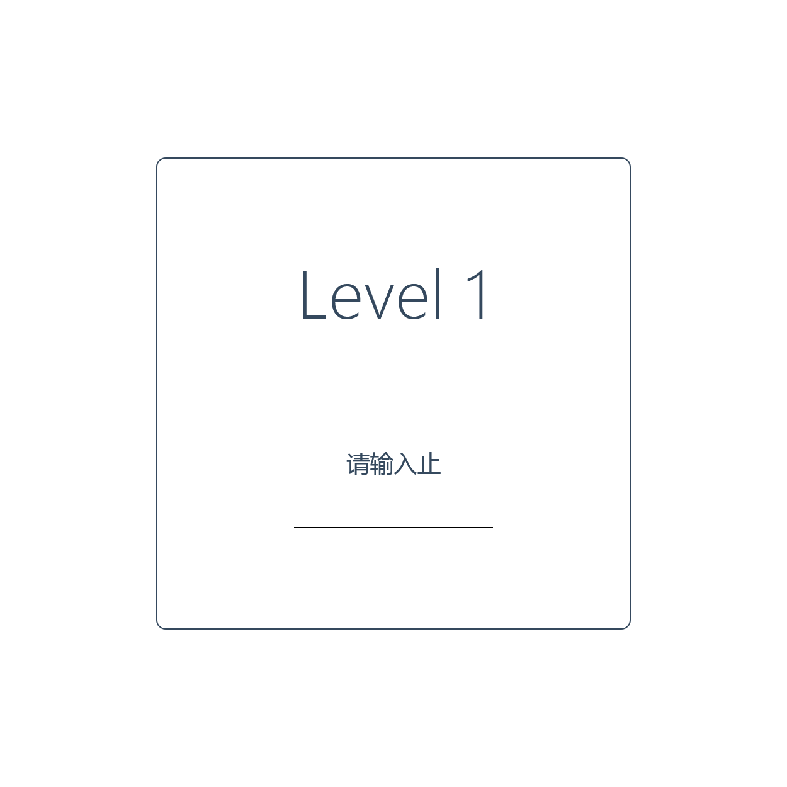

# 千字谜子题 95

## 题面

## 答案

`止`

## 解析

灵感来源于 Nazo Game（https://nazo.one-story.cn），第一关。

根据题目要求，答案显然为“止”。

## 本地附件

- [37b4f3999db246e79764a72b7897bfcb.webp](../../../assets/static.cipherpuzzles.com/static/images/37b4f3999db246e79764a72b7897bfcb.webp)

来源：[https://ccbc16.cipherpuzzles.com/data/c16-qian-puzzle.json#cid=95](https://ccbc16.cipherpuzzles.com/data/c16-qian-puzzle.json#cid=95)
