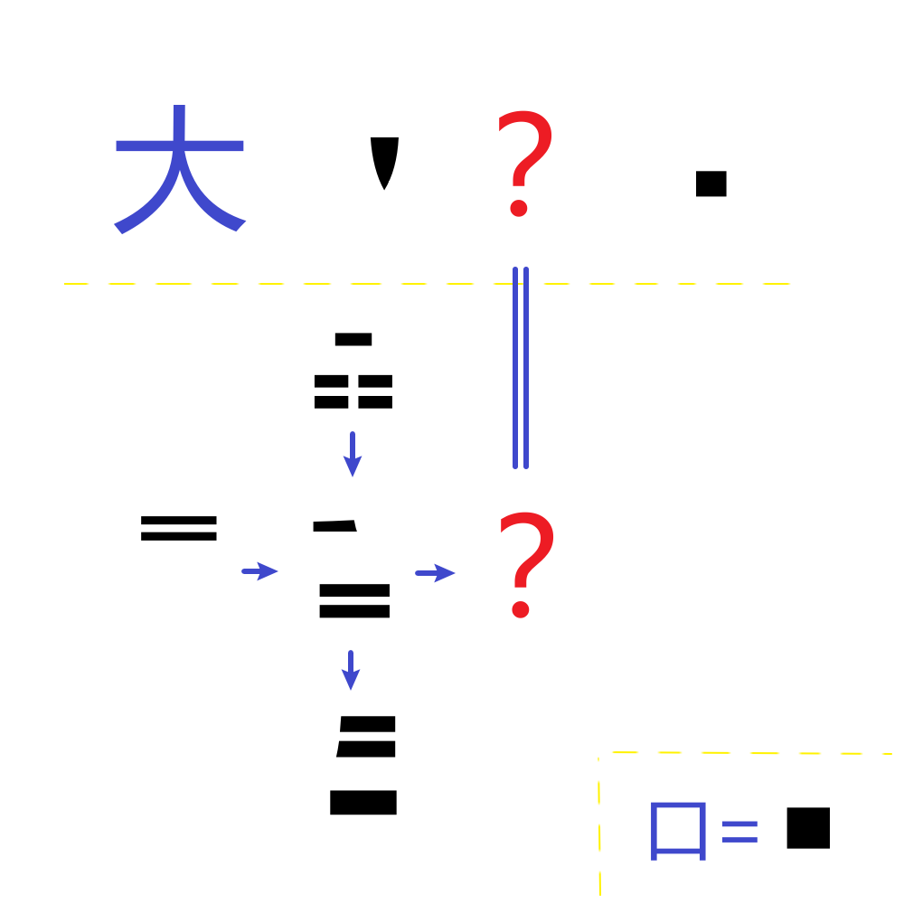

# 千字谜子题 954

## 题面

## 答案

`厥`

## 解析

右下提示了纱窗机制，即把一个字的封闭区域涂黑显示。下半区域是一个用一个四词重合来做提示，上方字和下方字很容易对上‘黄’和‘君’，可以推测中间是‘昏’字，与中央字左上角独特的孔洞形状对应。下半区域左侧可以相应由组词推测是‘晨’，而右侧待提取的字能够结合上半部进一步确定，是“大放厥词”/“昏厥”的‘厥’字。

## 本地附件

- [655f64df7d1d452aa779a694794d14b5.webp](../../../assets/static.cipherpuzzles.com/static/images/655f64df7d1d452aa779a694794d14b5.webp)

来源：[https://ccbc16.cipherpuzzles.com/data/c16-qian-puzzle.json#cid=954](https://ccbc16.cipherpuzzles.com/data/c16-qian-puzzle.json#cid=954)
