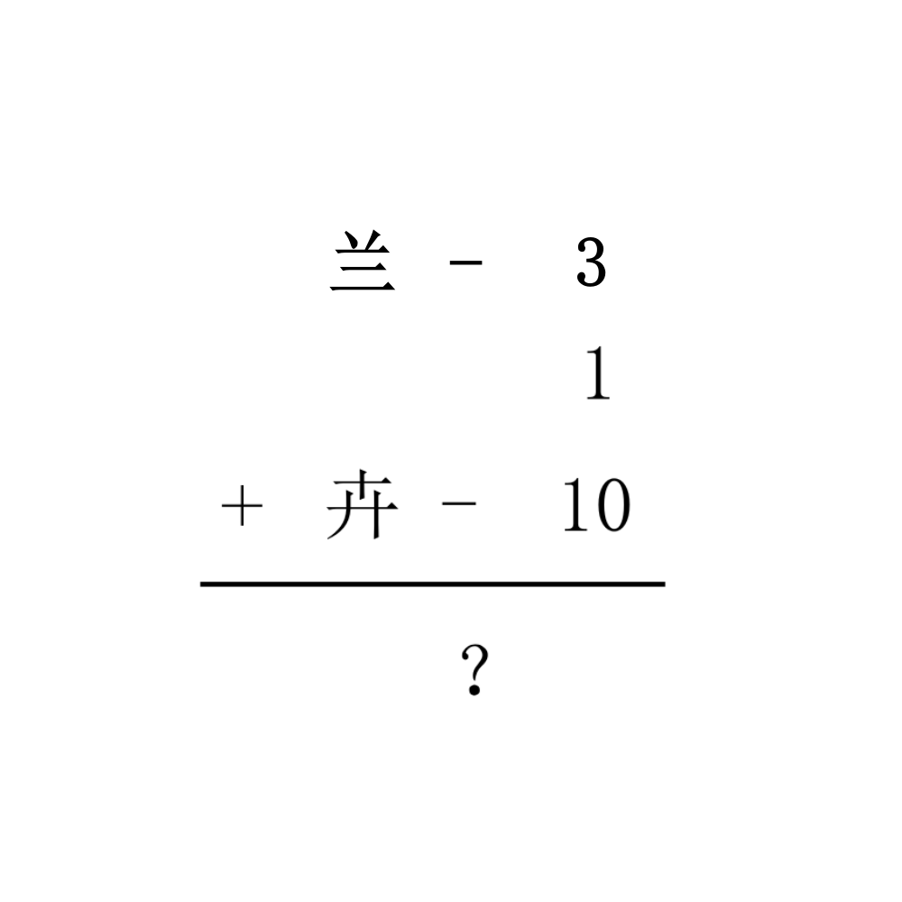

# 千字谜子题 96

## 题面

## 答案

`并`

## 解析

兰-3=兰-三=ソ

1=一

卉-10=卉-十=卄

   ソ
   ー
+ 卄
————
    并

## 本地附件

- [f3d91f613cf94632bf6fc2de65a0df3c.webp](../../../assets/static.cipherpuzzles.com/static/images/f3d91f613cf94632bf6fc2de65a0df3c.webp)

来源：[https://ccbc16.cipherpuzzles.com/data/c16-qian-puzzle.json#cid=96](https://ccbc16.cipherpuzzles.com/data/c16-qian-puzzle.json#cid=96)
