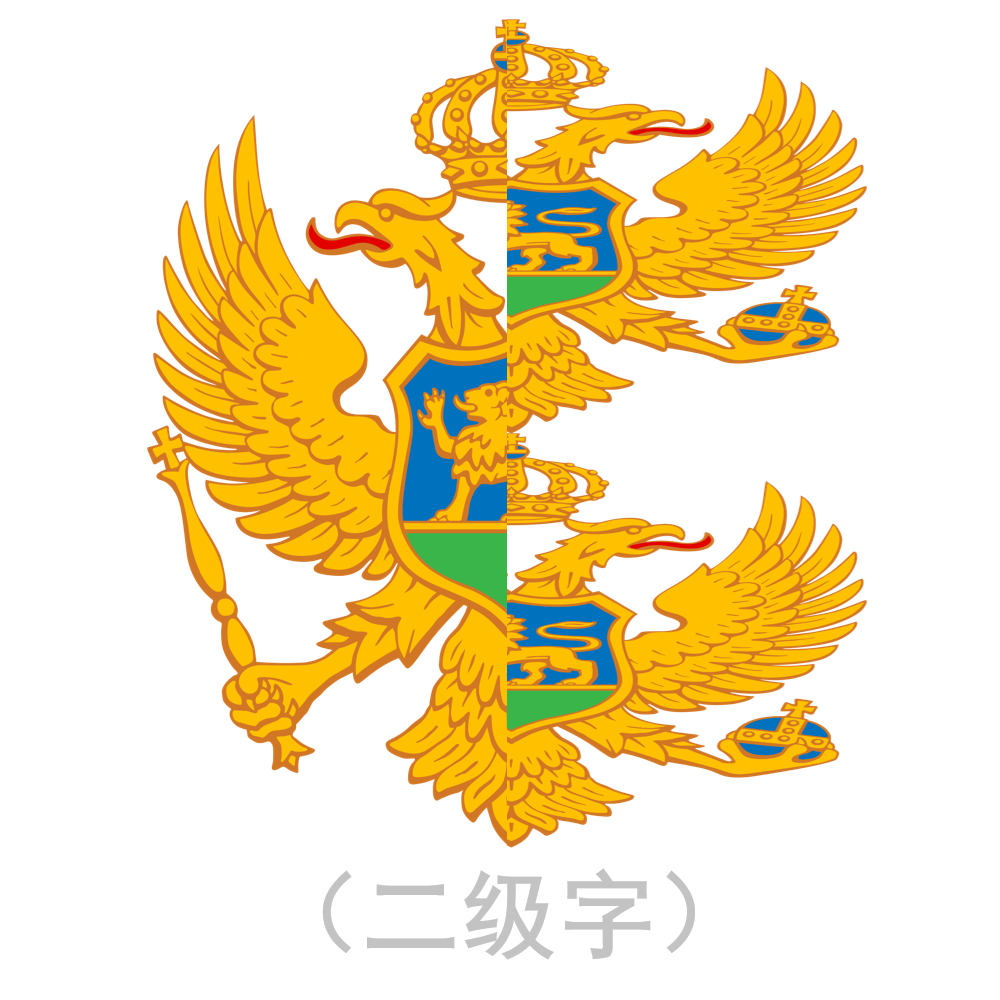

# 千字谜子题 960

## 题面

## 答案

`黜`

## 解析

图中为“黑山”的国徽，左半为“黑”右半为上下重复的“山”，拼字可得答案为“黜”。

## 本地附件

- [15221cc6d76e4461b00374a5640e2b5c.webp](../../../assets/static.cipherpuzzles.com/static/images/15221cc6d76e4461b00374a5640e2b5c.webp)

来源：[https://ccbc16.cipherpuzzles.com/data/c16-qian-puzzle.json#cid=960](https://ccbc16.cipherpuzzles.com/data/c16-qian-puzzle.json#cid=960)
