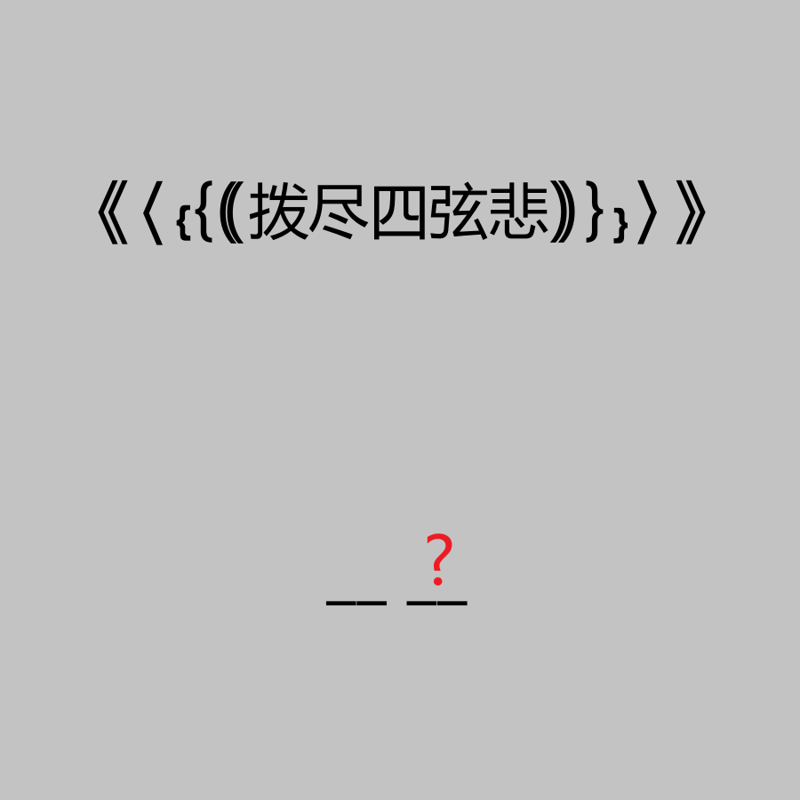

# 千字谜子题 961

## 题面

## 答案

`杷`

## 解析

_官方存档未填写解析。_

## 本地附件

- [ecb3811b0e2d4a13a06f0f5fb8f699dc.webp](../../../assets/static.cipherpuzzles.com/static/images/ecb3811b0e2d4a13a06f0f5fb8f699dc.webp)

来源：[https://ccbc16.cipherpuzzles.com/data/c16-qian-puzzle.json#cid=961](https://ccbc16.cipherpuzzles.com/data/c16-qian-puzzle.json#cid=961)
