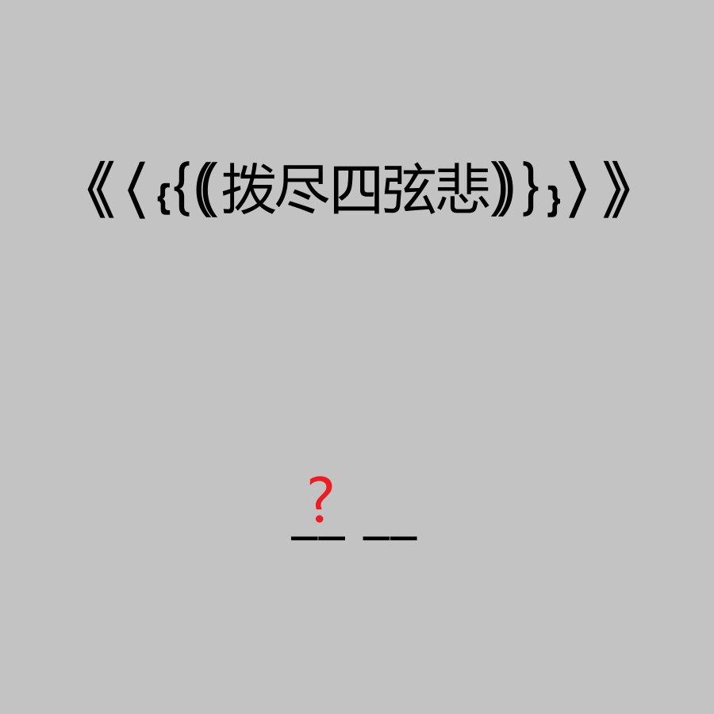

# 千字谜子题 962

## 题面

## 答案

`枇`

## 解析

_官方存档未填写解析。_

## 本地附件

- [a2e9ddcb78be41e5af2b82e6b76213f3.webp](../../../assets/static.cipherpuzzles.com/static/images/a2e9ddcb78be41e5af2b82e6b76213f3.webp)

来源：[https://ccbc16.cipherpuzzles.com/data/c16-qian-puzzle.json#cid=962](https://ccbc16.cipherpuzzles.com/data/c16-qian-puzzle.json#cid=962)
