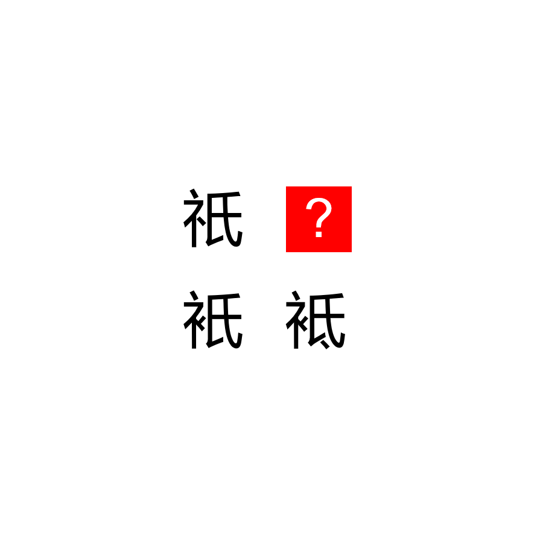

# 千字谜子题 963

## 题面

## 答案

`祗`

## 解析

祗易得

## 本地附件

- [098f1f8212064f819035dc4447b7a618.webp](../../../assets/static.cipherpuzzles.com/static/images/098f1f8212064f819035dc4447b7a618.webp)

来源：[https://ccbc16.cipherpuzzles.com/data/c16-qian-puzzle.json#cid=963](https://ccbc16.cipherpuzzles.com/data/c16-qian-puzzle.json#cid=963)
