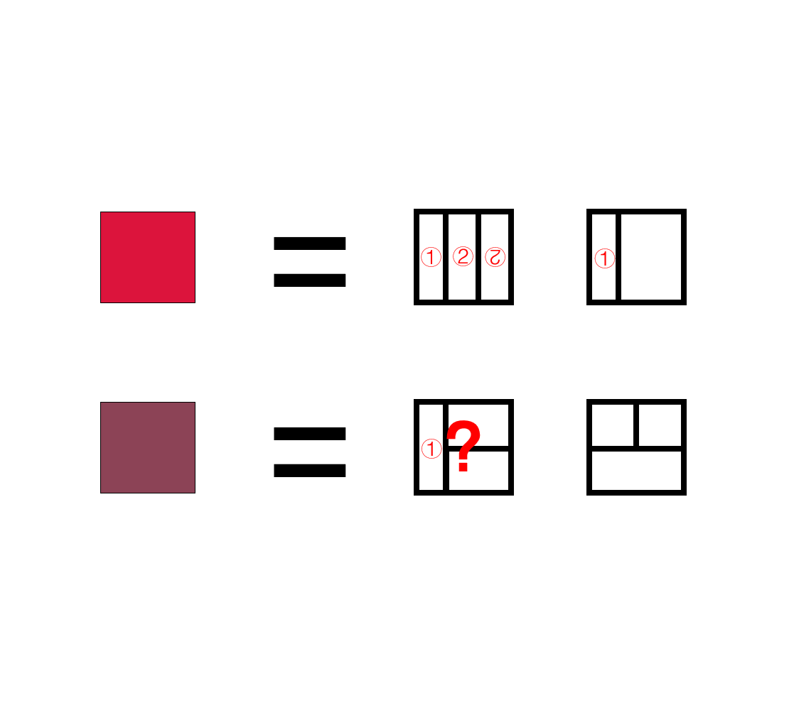

# 千字谜子题 964

## 题面

## 答案

`绛`

## 解析

（Ps：可以提取颜色得到 #8C4356）

## 本地附件

- [ece9ebf733c048c2b3d434e157db1b96.webp](../../../assets/static.cipherpuzzles.com/static/images/ece9ebf733c048c2b3d434e157db1b96.webp)

来源：[https://ccbc16.cipherpuzzles.com/data/c16-qian-puzzle.json#cid=964](https://ccbc16.cipherpuzzles.com/data/c16-qian-puzzle.json#cid=964)
