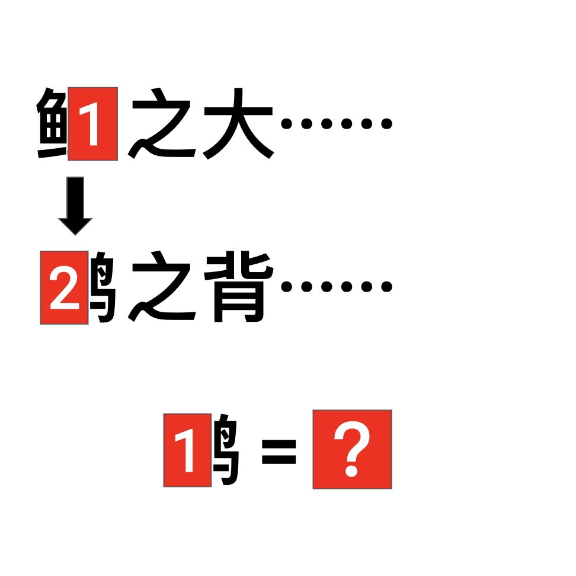

# 千字谜子题 967

## 题面

## 答案

`鹍`

## 解析

《逍遥游》原句：“北冥有鱼，其名为鲲。鲲之大，不知其几千里也；化而为鸟，其名为鹏。鹏之背，不知其几千里也......”。

## 本地附件

- [a8512506fd8c44508e511888e61b08da.webp](../../../assets/static.cipherpuzzles.com/static/images/a8512506fd8c44508e511888e61b08da.webp)

来源：[https://ccbc16.cipherpuzzles.com/data/c16-qian-puzzle.json#cid=967](https://ccbc16.cipherpuzzles.com/data/c16-qian-puzzle.json#cid=967)
