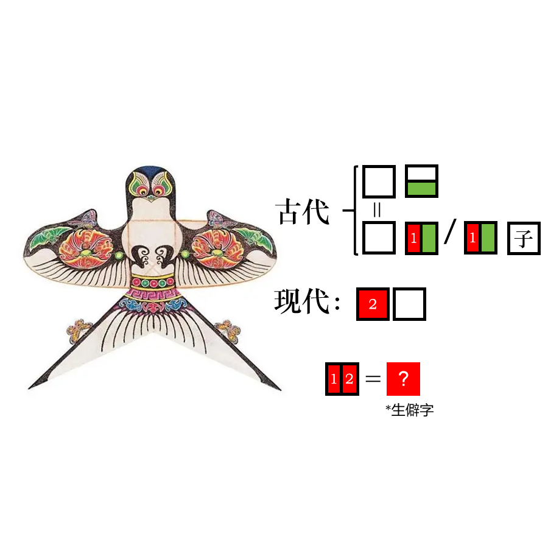

# 千字谜子题 969

## 题面

## 答案

`飖`

## 解析

从上到下：纸鸢 纸鹞/鹞子 风筝 飖

## 本地附件

- [ffce4546f1c446ba8d19b238495fb29a.webp](../../../assets/static.cipherpuzzles.com/static/images/ffce4546f1c446ba8d19b238495fb29a.webp)

来源：[https://ccbc16.cipherpuzzles.com/data/c16-qian-puzzle.json#cid=969](https://ccbc16.cipherpuzzles.com/data/c16-qian-puzzle.json#cid=969)
