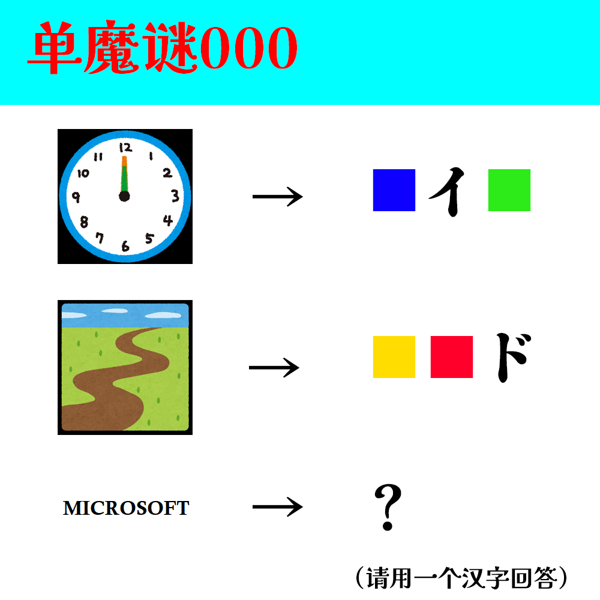

# 千字谜子题 97

## 题面

## 答案

`殆`

## 解析

根据题目可知，红黄蓝绿方块分别对应的日文片假名分别为ーロタム。最后按照旧windos的logo放置象形得到“殆”。

## 本地附件

- [c78f0cead27042bf8a61d70009933b4e.webp](../../../assets/static.cipherpuzzles.com/static/images/c78f0cead27042bf8a61d70009933b4e.webp)

来源：[https://ccbc16.cipherpuzzles.com/data/c16-qian-puzzle.json#cid=97](https://ccbc16.cipherpuzzles.com/data/c16-qian-puzzle.json#cid=97)
