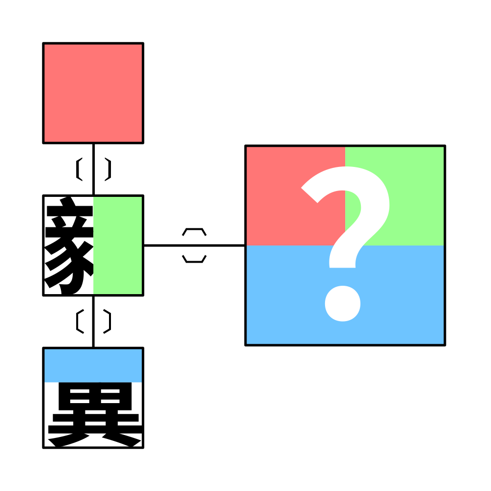

# 千字谜子题 971

## 题面

## 答案

`翳`

## 解析

医-毅-翼 和 翳 同音，用前三字对应位置的字形组合出这个字。

## 本地附件

- [894300a795b84cc29bf95e192e78bb1f.webp](../../../assets/static.cipherpuzzles.com/static/images/894300a795b84cc29bf95e192e78bb1f.webp)

来源：[https://ccbc16.cipherpuzzles.com/data/c16-qian-puzzle.json#cid=971](https://ccbc16.cipherpuzzles.com/data/c16-qian-puzzle.json#cid=971)
