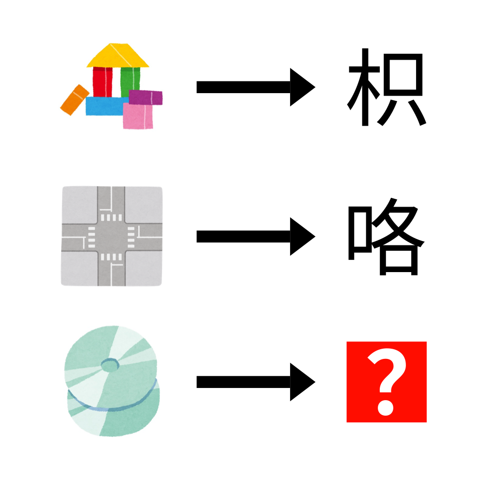

# 千字谜子题 973

## 题面

## 答案

`牒`

## 解析

_官方存档未填写解析。_

## 本地附件

- [552ad873479c4d358e8893534a0201a0.webp](../../../assets/static.cipherpuzzles.com/static/images/552ad873479c4d358e8893534a0201a0.webp)

来源：[https://ccbc16.cipherpuzzles.com/data/c16-qian-puzzle.json#cid=973](https://ccbc16.cipherpuzzles.com/data/c16-qian-puzzle.json#cid=973)
