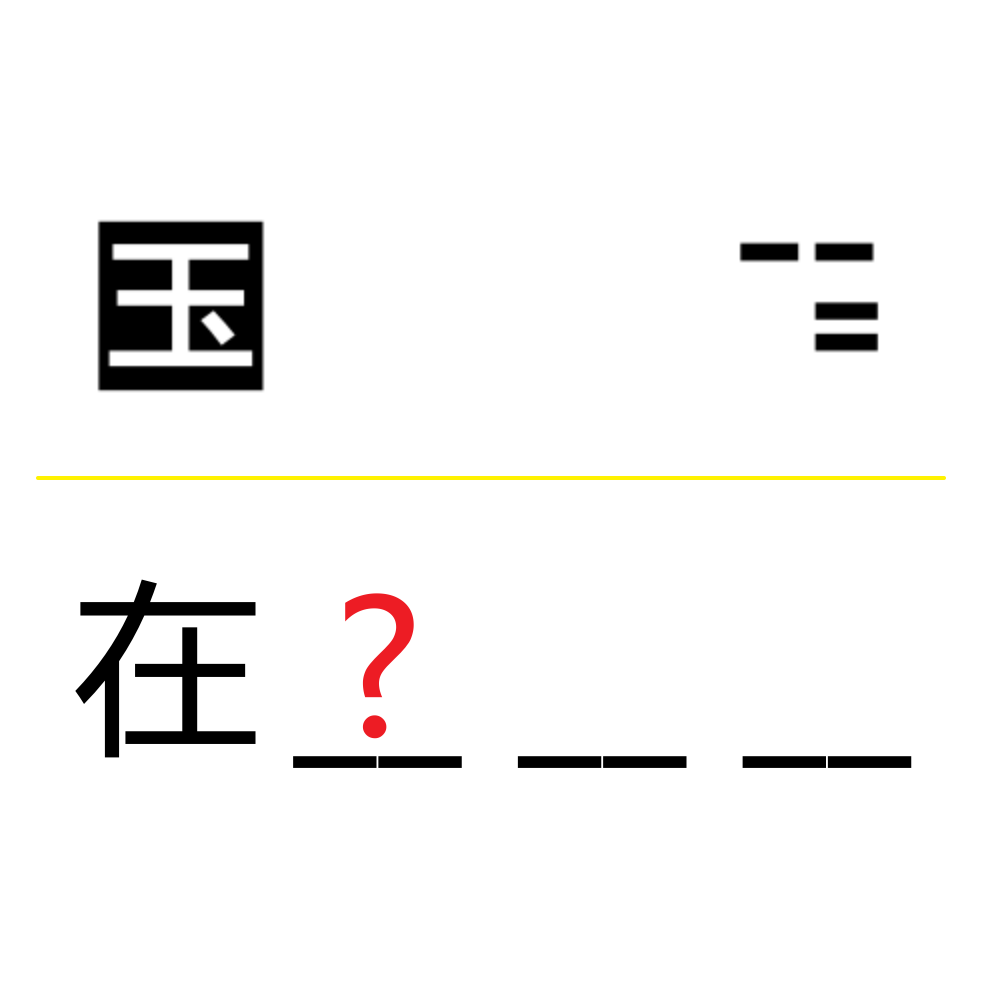

# 千字谜子题 979

## 题面

## 答案

`祀`

## 解析

上句纱窗（即取字形有孔的部分涂色）为“国之大事”，下句“在祀与戎”，取‘祀’

## 本地附件

- [e60f7a98b2b9412eaf5e32f7acb0f065.webp](../../../assets/static.cipherpuzzles.com/static/images/e60f7a98b2b9412eaf5e32f7acb0f065.webp)

来源：[https://ccbc16.cipherpuzzles.com/data/c16-qian-puzzle.json#cid=979](https://ccbc16.cipherpuzzles.com/data/c16-qian-puzzle.json#cid=979)
