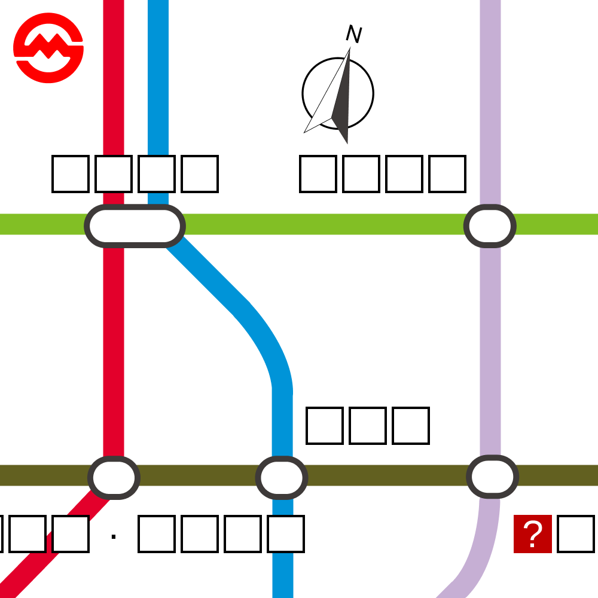

# 千字谜子题 98

## 题面

## 答案

`豫`

## 解析

图片左上角的图标提示本题主题为上海地铁。在地铁线路图中可找到对应部分。图中五个站点均为换乘站，从左上角开始，顺时针依次为人民广场、南京东路、豫园、大世界、一大会址·黄陂南路。答案为问号处的字“豫”。
另外，南京东路和一大会址·黄陂南路的两个“南”字均处在指南针图标向南的延长线上，提供了交叉验证。

## 本地附件

- [c2a6a74f8d834403a2ff68589ef6575b.webp](../../../assets/static.cipherpuzzles.com/static/images/c2a6a74f8d834403a2ff68589ef6575b.webp)

来源：[https://ccbc16.cipherpuzzles.com/data/c16-qian-puzzle.json#cid=98](https://ccbc16.cipherpuzzles.com/data/c16-qian-puzzle.json#cid=98)
