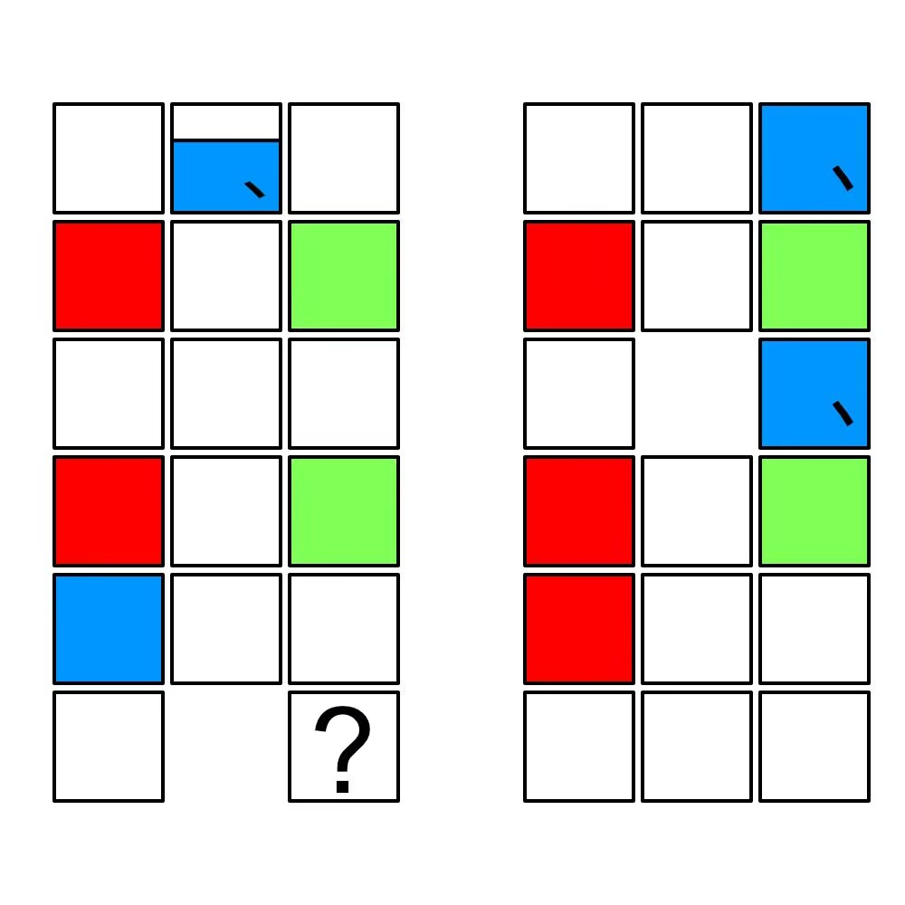

# 千字谜子题 981

## 题面

## 答案

`纨`

## 解析

金陵十二钗

## 本地附件

- [53dbac04f5b94a50b9602b9838beb06c.webp](../../../assets/static.cipherpuzzles.com/static/images/53dbac04f5b94a50b9602b9838beb06c.webp)

来源：[https://ccbc16.cipherpuzzles.com/data/c16-qian-puzzle.json#cid=981](https://ccbc16.cipherpuzzles.com/data/c16-qian-puzzle.json#cid=981)
