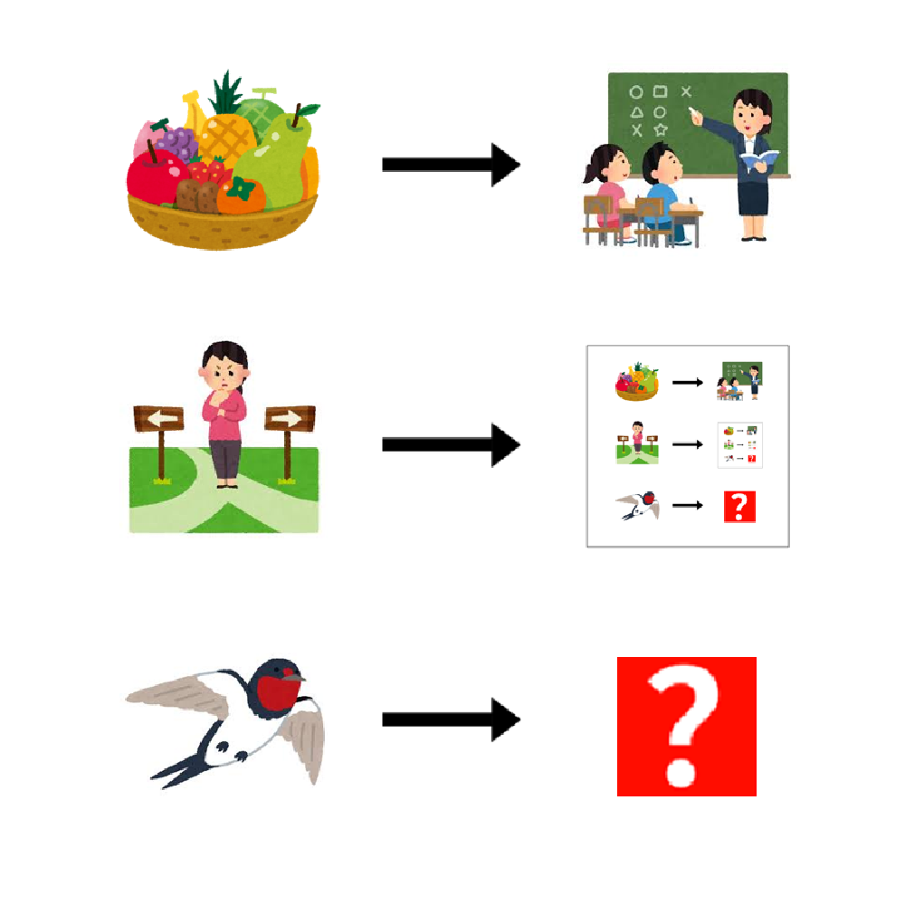

# 千字谜子题 984

## 题面

## 答案

`䜩`

## 解析

果→课
迷→谜
燕→䜩

## 本地附件

- [79f87a2848084b158480b387ce7a8248.webp](../../../assets/static.cipherpuzzles.com/static/images/79f87a2848084b158480b387ce7a8248.webp)

来源：[https://ccbc16.cipherpuzzles.com/data/c16-qian-puzzle.json#cid=984](https://ccbc16.cipherpuzzles.com/data/c16-qian-puzzle.json#cid=984)
