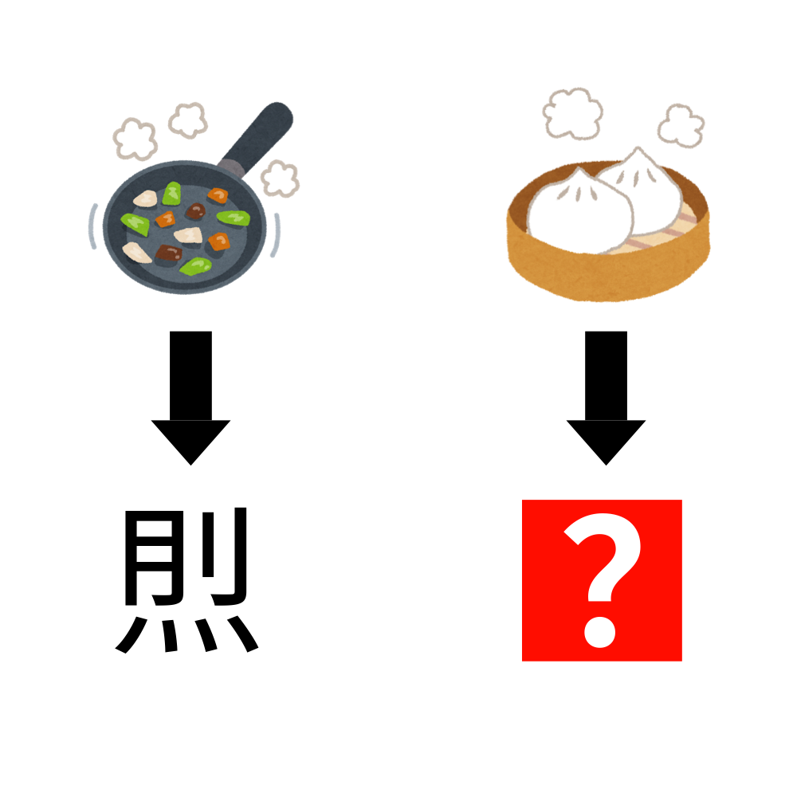

# 千字谜子题 986

## 题面

## 答案

`烝`

## 解析

_官方存档未填写解析。_

## 本地附件

- [f15ea699712b4458acd2d212b718661e.webp](../../../assets/static.cipherpuzzles.com/static/images/f15ea699712b4458acd2d212b718661e.webp)

来源：[https://ccbc16.cipherpuzzles.com/data/c16-qian-puzzle.json#cid=986](https://ccbc16.cipherpuzzles.com/data/c16-qian-puzzle.json#cid=986)
