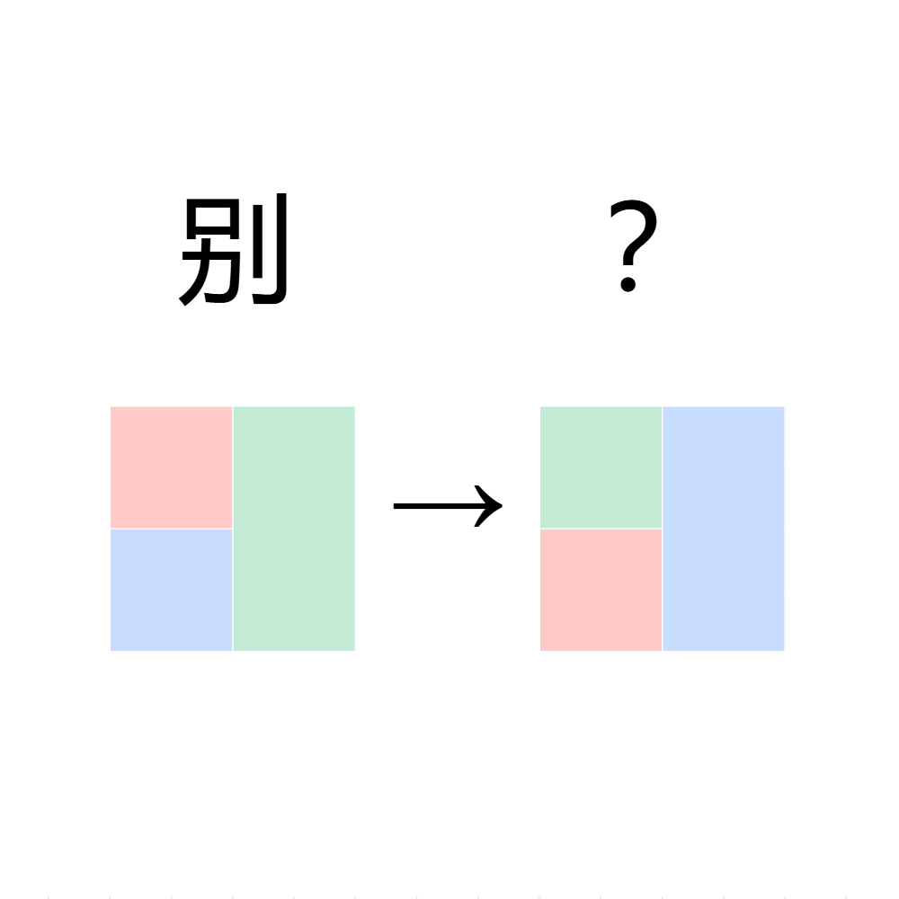

# 千字谜子题 987

## 题面

## 答案

`劭`

## 解析

_官方存档未填写解析。_

## 本地附件

- [791be529692a4602959147755f4e34a1.webp](../../../assets/static.cipherpuzzles.com/static/images/791be529692a4602959147755f4e34a1.webp)

来源：[https://ccbc16.cipherpuzzles.com/data/c16-qian-puzzle.json#cid=987](https://ccbc16.cipherpuzzles.com/data/c16-qian-puzzle.json#cid=987)
