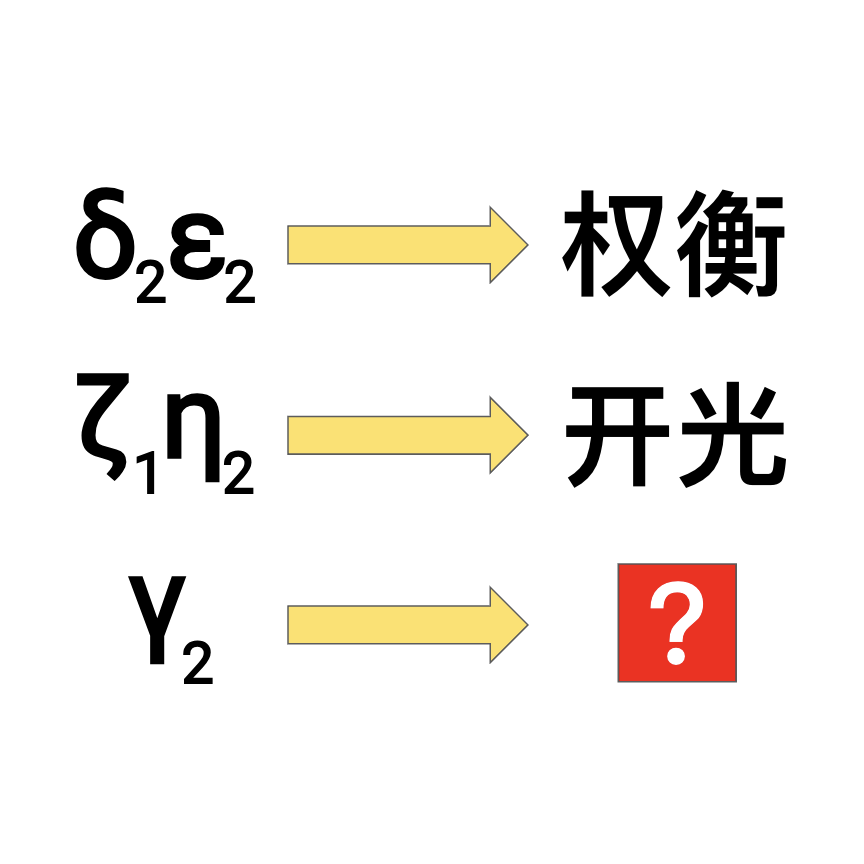

# 千字谜子题 988

## 题面

## 答案

`玑`

## 解析

希腊字母代表的是北斗七星，数字表示取星名的第几个字。

## 本地附件

- [1cbb60e146d3489db9ef82744b5af1f6.webp](../../../assets/static.cipherpuzzles.com/static/images/1cbb60e146d3489db9ef82744b5af1f6.webp)

来源：[https://ccbc16.cipherpuzzles.com/data/c16-qian-puzzle.json#cid=988](https://ccbc16.cipherpuzzles.com/data/c16-qian-puzzle.json#cid=988)
