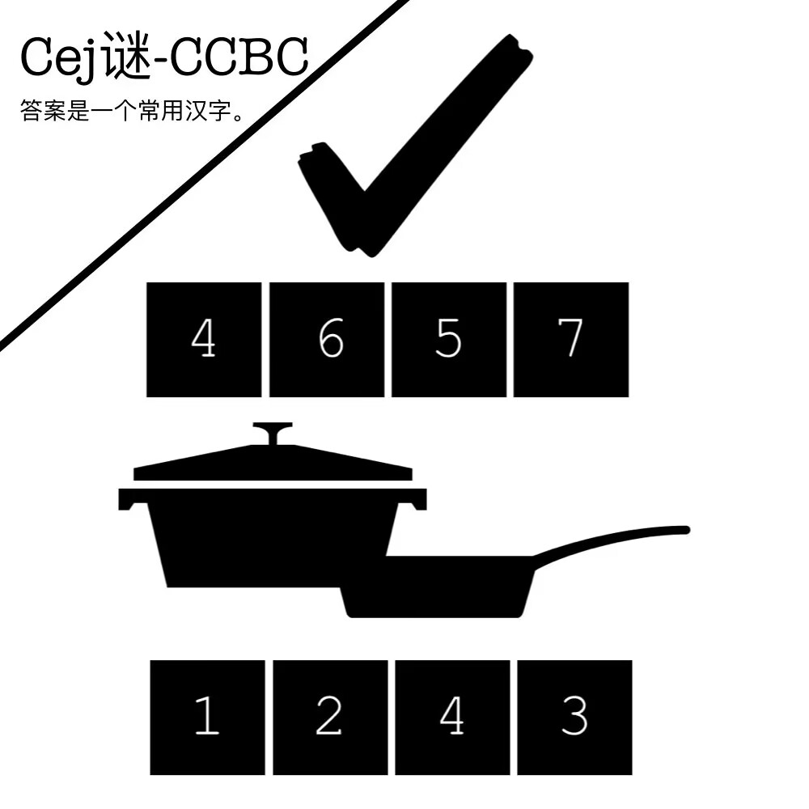

# 千字谜子题 99

## 题面

## 答案

`姿`

## 解析

上TRUE下POTS，合起来是POSTURE。翻译成中文即可。

## 本地附件

- [a4665f93729b4a9a892e29dcced17504.webp](../../../assets/static.cipherpuzzles.com/static/images/a4665f93729b4a9a892e29dcced17504.webp)

来源：[https://ccbc16.cipherpuzzles.com/data/c16-qian-puzzle.json#cid=99](https://ccbc16.cipherpuzzles.com/data/c16-qian-puzzle.json#cid=99)
