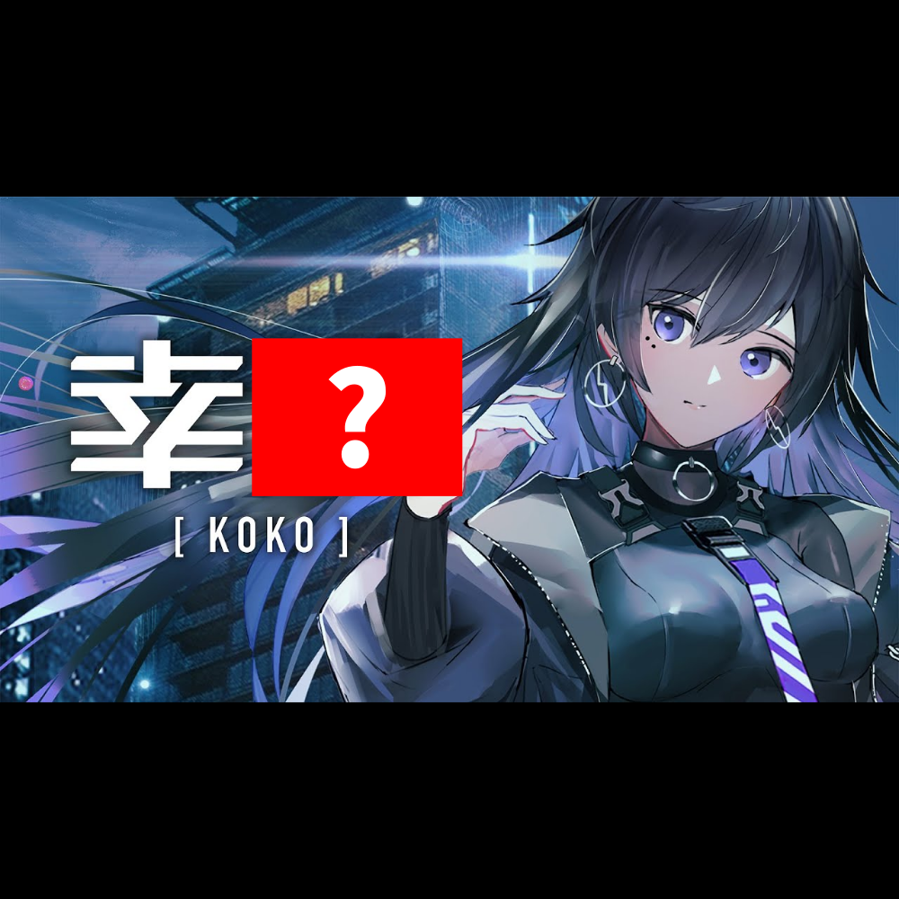

# 千字谜子题 994

## 题面

## 答案

`祜`

## 解析

搜索图片可知，图片内容是神椿旗下的虚拟歌手幸祜。由此可得问号处的汉字是祜。

## 本地附件

- [61014cd0680a4f52a964557e90a6726e.webp](../../../assets/static.cipherpuzzles.com/static/images/61014cd0680a4f52a964557e90a6726e.webp)

来源：[https://ccbc16.cipherpuzzles.com/data/c16-qian-puzzle.json#cid=994](https://ccbc16.cipherpuzzles.com/data/c16-qian-puzzle.json#cid=994)
