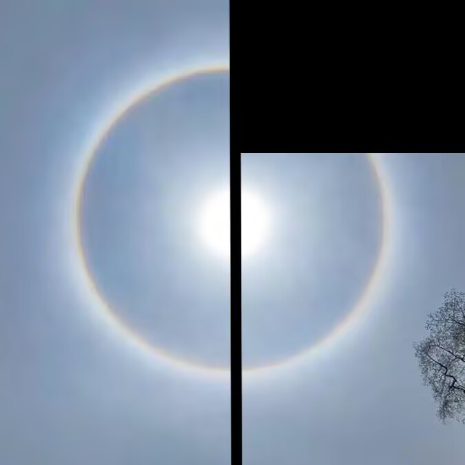

# 千字谜子题 997

## 题面

## 答案

`晖`

## 解析

日晕

## 本地附件

- [e1f9b2c27faf4374a2362197bec5fe06.webp](../../../assets/static.cipherpuzzles.com/static/images/e1f9b2c27faf4374a2362197bec5fe06.webp)

来源：[https://ccbc16.cipherpuzzles.com/data/c16-qian-puzzle.json#cid=997](https://ccbc16.cipherpuzzles.com/data/c16-qian-puzzle.json#cid=997)
