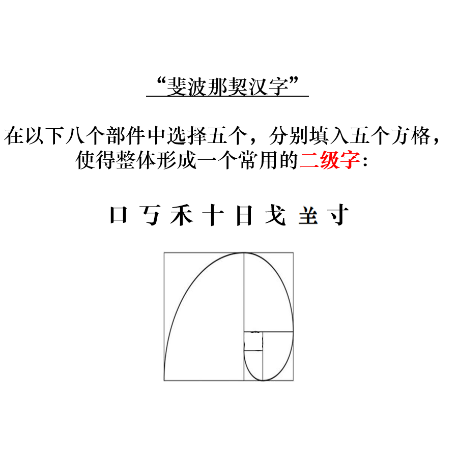

# 千字谜子题 998

## 题面

## 答案

`曦`

## 解析

_官方存档未填写解析。_

## 本地附件

- [ef05510369ca46c5a539787a03728592.webp](../../../assets/static.cipherpuzzles.com/static/images/ef05510369ca46c5a539787a03728592.webp)

来源：[https://ccbc16.cipherpuzzles.com/data/c16-qian-puzzle.json#cid=998](https://ccbc16.cipherpuzzles.com/data/c16-qian-puzzle.json#cid=998)
