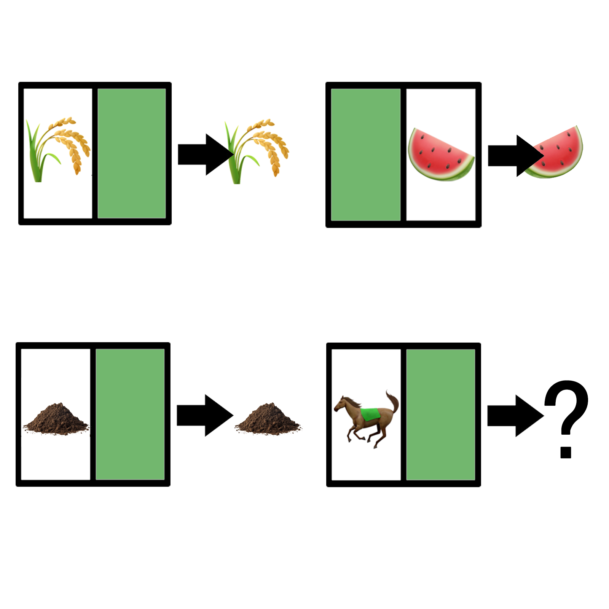

# 千字谜子题 999

## 题面

## 答案

`骧`

## 解析

禾＋襄→穰
襄＋瓜→瓤
土＋襄→壤
马＋襄→骧

## 本地附件

- [ccf287ae025a4c3faf428f8b01a92354.webp](../../../assets/static.cipherpuzzles.com/static/images/ccf287ae025a4c3faf428f8b01a92354.webp)

来源：[https://ccbc16.cipherpuzzles.com/data/c16-qian-puzzle.json#cid=999](https://ccbc16.cipherpuzzles.com/data/c16-qian-puzzle.json#cid=999)
