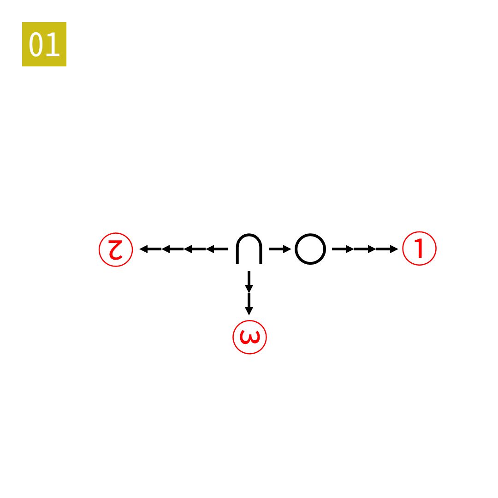

# 2025年度解谜能力测试 第 1 题

## 题面

## 答案

`RYE`

## 解析

右箭头表示字典序+1。向下或向左的箭头需要旋转题面之后再字典序+1。

## 本地附件

- [30335c82ab9f4dc8ab7cdbeb4bd50f1d.webp](../../../assets/static.cipherpuzzles.com/static/images/30335c82ab9f4dc8ab7cdbeb4bd50f1d.webp)

来源：[https://ccbc16.cipherpuzzles.com/data/puzzle_script/c16-puzzle-solving-test.js#1](https://ccbc16.cipherpuzzles.com/data/puzzle_script/c16-puzzle-solving-test.js#1)
