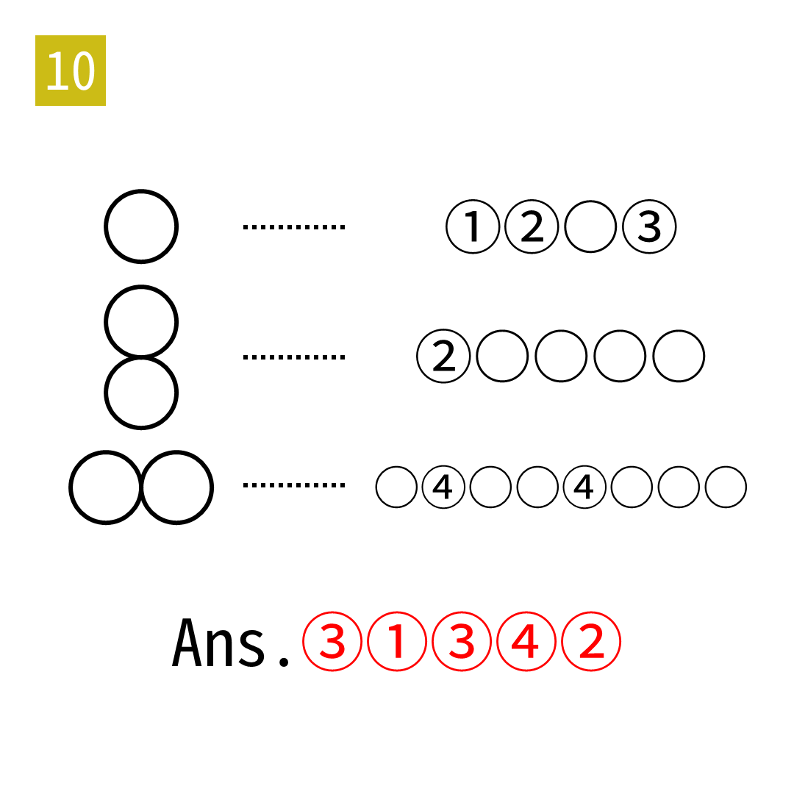

# 2025年度解谜能力测试 第 10 题

## 题面

## 答案

`OZONE`

## 解析

填入 ZERO、EIGHT、INFINITY。

## 本地附件

- [530e5e323234472b8cc02886ba5570ca.webp](../../../assets/static.cipherpuzzles.com/static/images/530e5e323234472b8cc02886ba5570ca.webp)

来源：[https://ccbc16.cipherpuzzles.com/data/puzzle_script/c16-puzzle-solving-test.js#10](https://ccbc16.cipherpuzzles.com/data/puzzle_script/c16-puzzle-solving-test.js#10)
