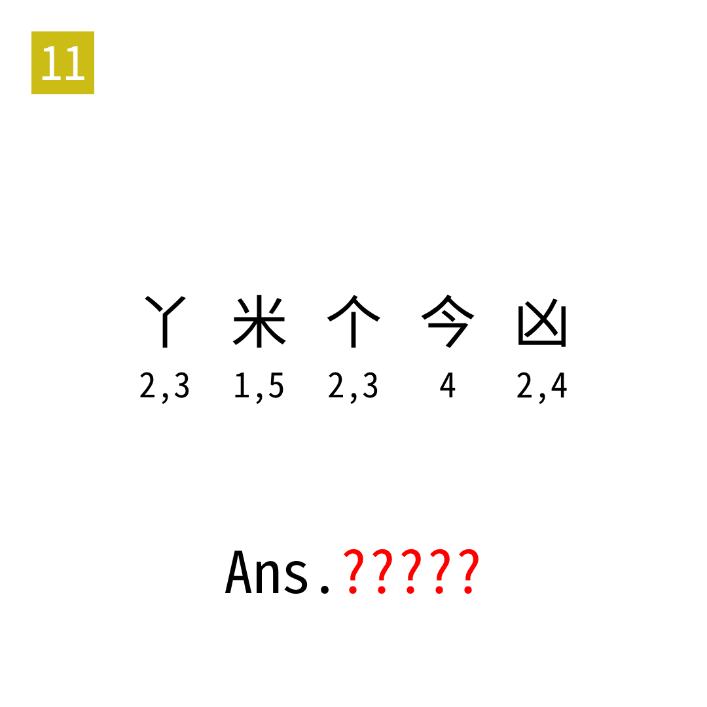

# 2025年度解谜能力测试 第 11 题

## 题面

## 答案

`EIGHT`

## 解析

取对应笔画之后转旗语。

## 本地附件

- [b40fe7a0893645b89b16365385a3cf92.webp](../../../assets/static.cipherpuzzles.com/static/images/b40fe7a0893645b89b16365385a3cf92.webp)

来源：[https://ccbc16.cipherpuzzles.com/data/puzzle_script/c16-puzzle-solving-test.js#11](https://ccbc16.cipherpuzzles.com/data/puzzle_script/c16-puzzle-solving-test.js#11)
