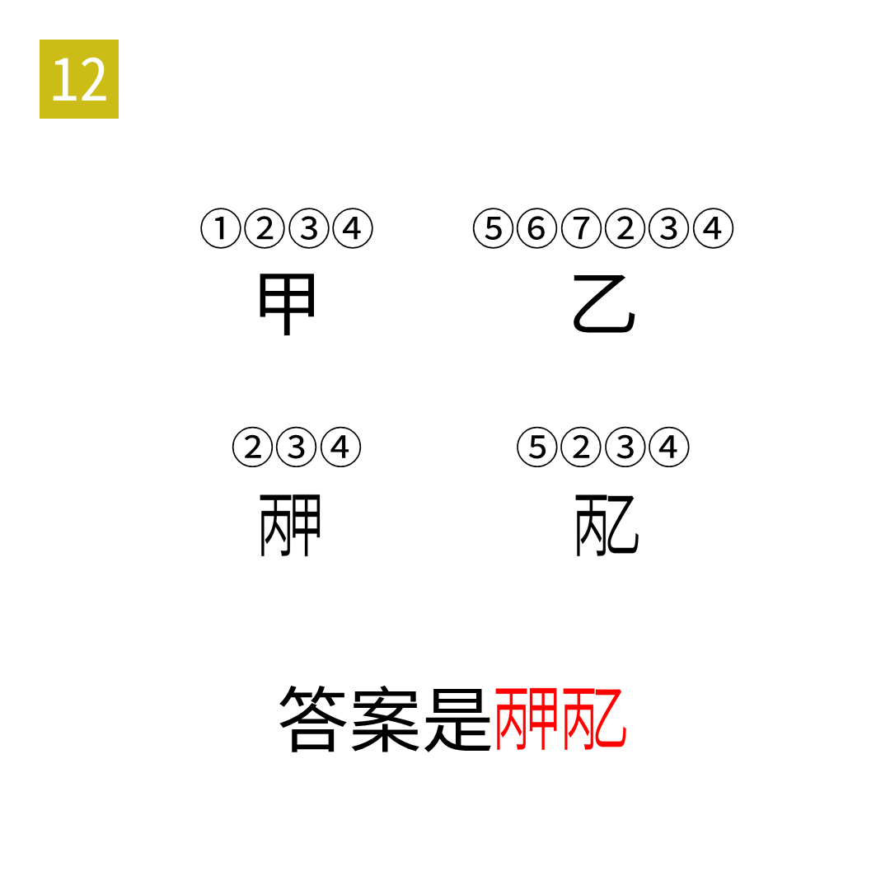

# 2025年度解谜能力测试 第 12 题

## 题面

## 答案

`肮脏`

## 解析

甲乙丙表示三个汉字，上面的带圈数字表示汉字对应的拼音。

## 本地附件

- [558ae48f5a4443ef9940d36fb2ce9e64.webp](../../../assets/static.cipherpuzzles.com/static/images/558ae48f5a4443ef9940d36fb2ce9e64.webp)

来源：[https://ccbc16.cipherpuzzles.com/data/puzzle_script/c16-puzzle-solving-test.js#12](https://ccbc16.cipherpuzzles.com/data/puzzle_script/c16-puzzle-solving-test.js#12)
