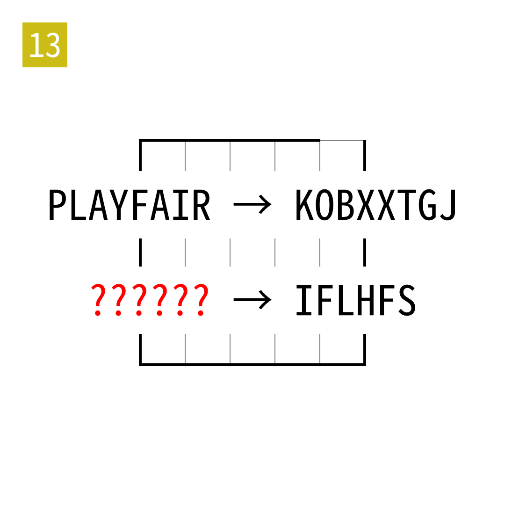

# 2025年度解谜能力测试 第 13 题

## 题面

## 答案

`EGOIST`

## 解析

在02中的网格上使用Playfair密码。

## 本地附件

- [4cf33d038cec479ca7c3f0a96f881d43.webp](../../../assets/static.cipherpuzzles.com/static/images/4cf33d038cec479ca7c3f0a96f881d43.webp)

来源：[https://ccbc16.cipherpuzzles.com/data/puzzle_script/c16-puzzle-solving-test.js#13](https://ccbc16.cipherpuzzles.com/data/puzzle_script/c16-puzzle-solving-test.js#13)
