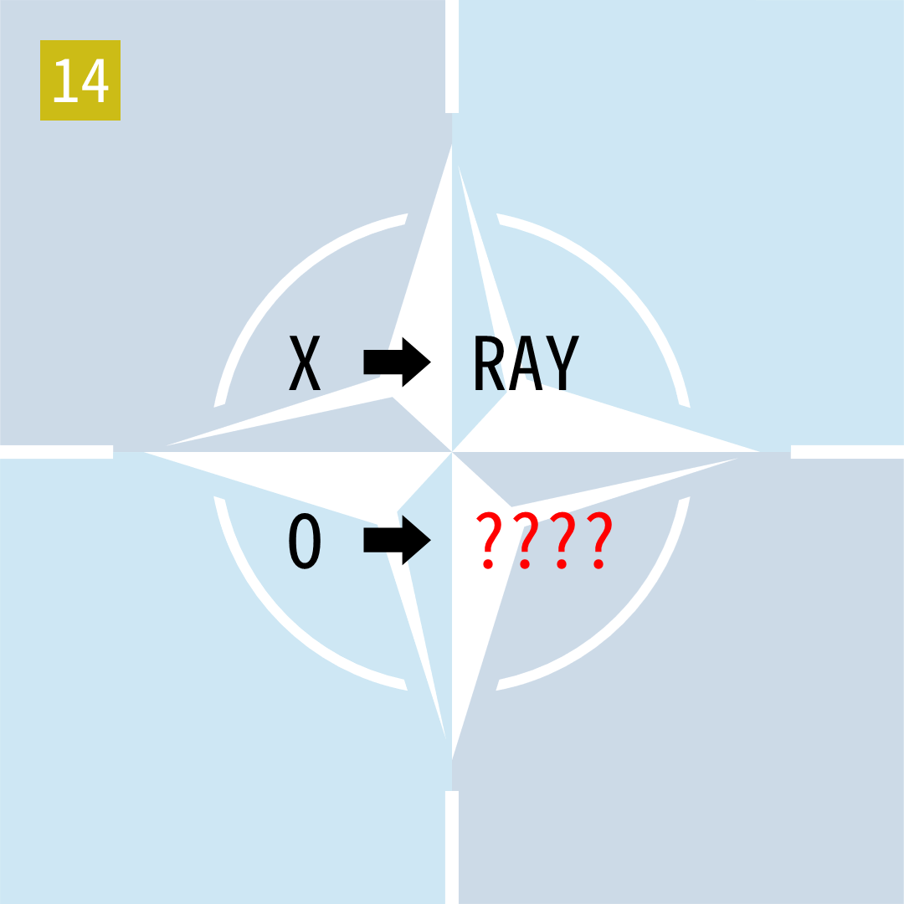

# 2025年度解谜能力测试 第 14 题

## 题面

## 答案

`SCAR`

## 解析

背景图是NATO的标志。箭头表示取字母对应的NATO单词，然后去掉首字母。

## 本地附件

- [4c7fea4fa94b4c40b76089b1343602ac.webp](../../../assets/static.cipherpuzzles.com/static/images/4c7fea4fa94b4c40b76089b1343602ac.webp)

来源：[https://ccbc16.cipherpuzzles.com/data/puzzle_script/c16-puzzle-solving-test.js#14](https://ccbc16.cipherpuzzles.com/data/puzzle_script/c16-puzzle-solving-test.js#14)
