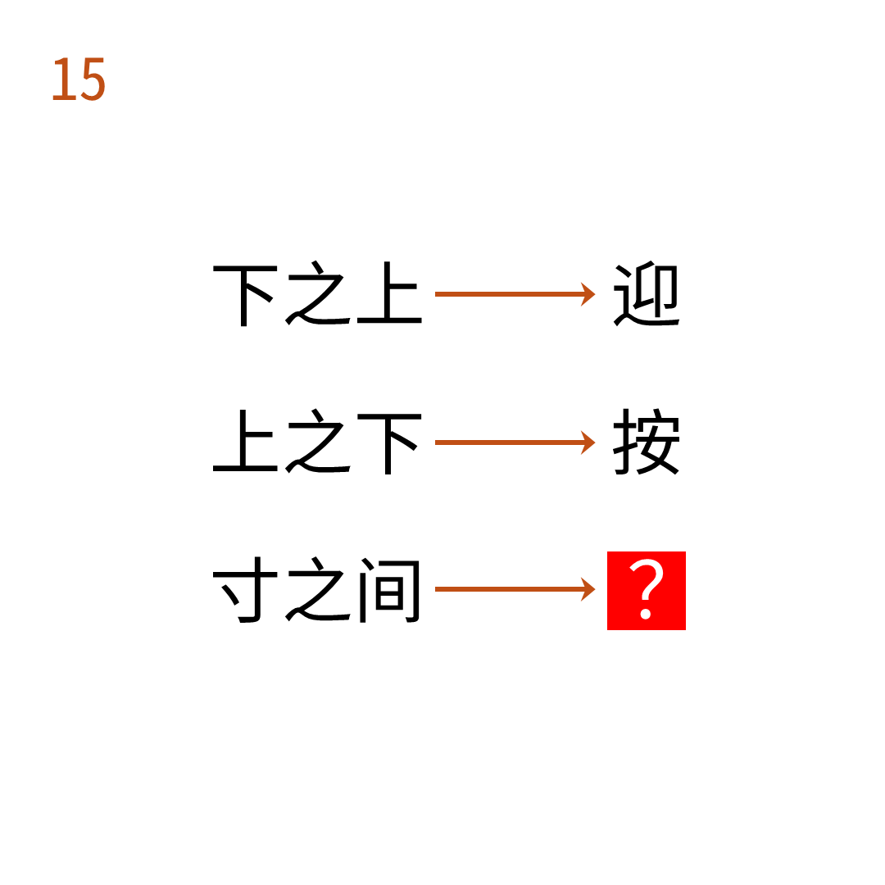

# 2025年度解谜能力测试 第 15 题

## 题面

## 答案

`式`

## 解析

本题使用注意事项。注意事项中含有两个寸（汉字部件）。取两个寸之间的汉字。

## 本地附件

- [262411f42add413e9bb815f1732439c7.webp](../../../assets/static.cipherpuzzles.com/static/images/262411f42add413e9bb815f1732439c7.webp)

来源：[https://ccbc16.cipherpuzzles.com/data/puzzle_script/c16-puzzle-solving-test.js#15](https://ccbc16.cipherpuzzles.com/data/puzzle_script/c16-puzzle-solving-test.js#15)
