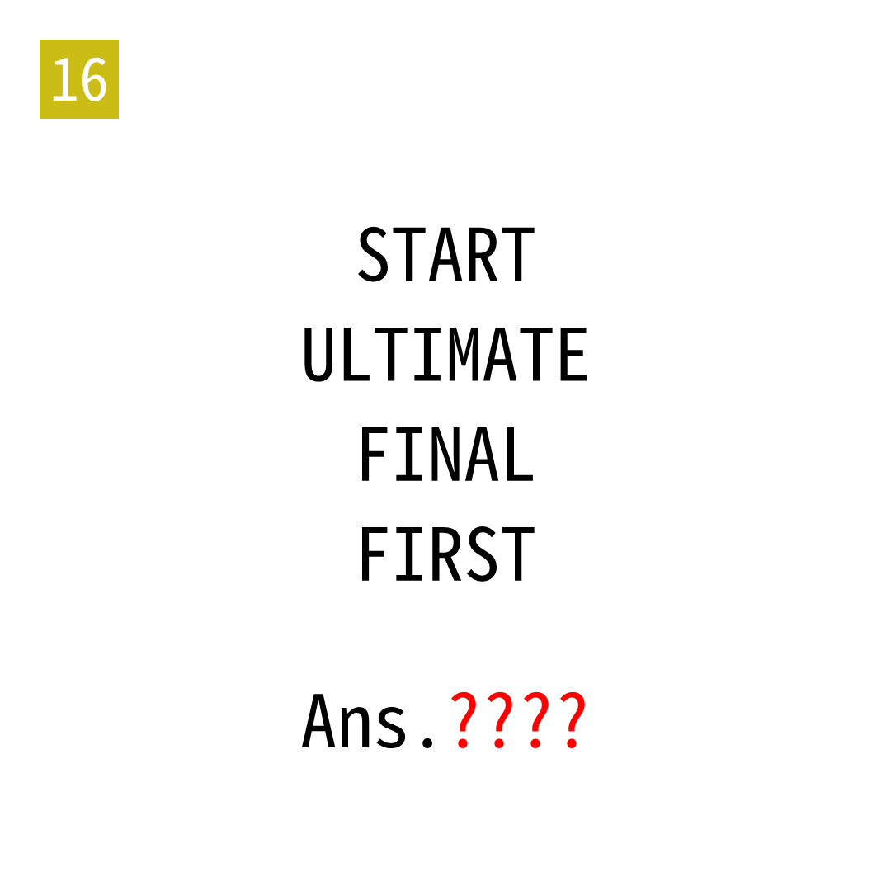

# 2025年度解谜能力测试 第 16 题

## 题面

## 答案

`SELF`

## 解析

按照单词含义提取首字母或尾字母。

## 本地附件

- [c6eb4748ca5c45e8b01affcc37d18384.webp](../../../assets/static.cipherpuzzles.com/static/images/c6eb4748ca5c45e8b01affcc37d18384.webp)

来源：[https://ccbc16.cipherpuzzles.com/data/puzzle_script/c16-puzzle-solving-test.js#16](https://ccbc16.cipherpuzzles.com/data/puzzle_script/c16-puzzle-solving-test.js#16)
