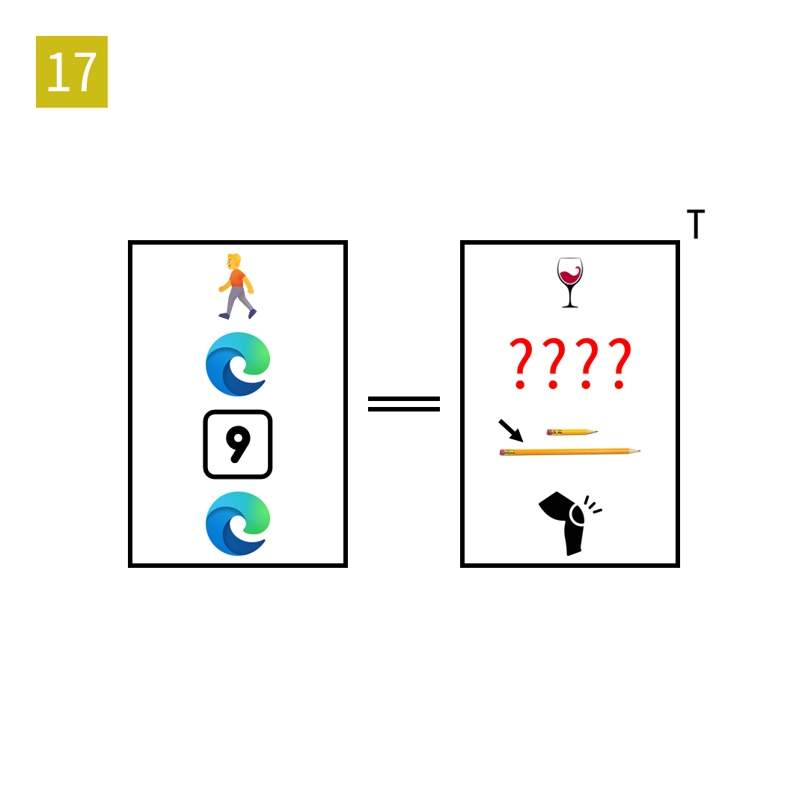

# 2025年度解谜能力测试 第 17 题

## 题面

## 答案

`ACID`

## 解析

所有单词长度为4。左边的4x4字母矩阵是右边的4x4字母矩阵的转置。左侧依次为 WALK、ICON、NINE、EDGE，右侧依次为 WINE、ACID、LONG、KNEE。

## 本地附件

- [82ef7799e0a2429a82ade83554a66991.webp](../../../assets/static.cipherpuzzles.com/static/images/82ef7799e0a2429a82ade83554a66991.webp)

来源：[https://ccbc16.cipherpuzzles.com/data/puzzle_script/c16-puzzle-solving-test.js#17](https://ccbc16.cipherpuzzles.com/data/puzzle_script/c16-puzzle-solving-test.js#17)
