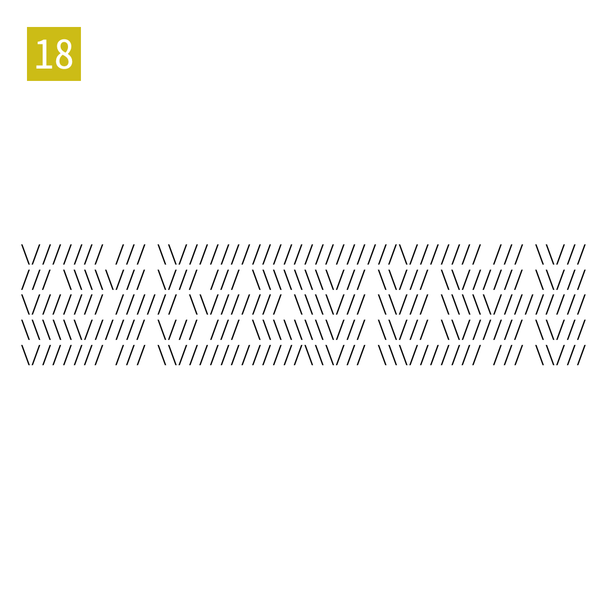

# 2025年度解谜能力测试 第 18 题

## 题面

## 答案

`SKETCH`

## 解析

读所有"/"的位置象形。

## 本地附件

- [7de45c727ce24fe48e4666bb78728777.webp](../../../assets/static.cipherpuzzles.com/static/images/7de45c727ce24fe48e4666bb78728777.webp)

来源：[https://ccbc16.cipherpuzzles.com/data/puzzle_script/c16-puzzle-solving-test.js#18](https://ccbc16.cipherpuzzles.com/data/puzzle_script/c16-puzzle-solving-test.js#18)
