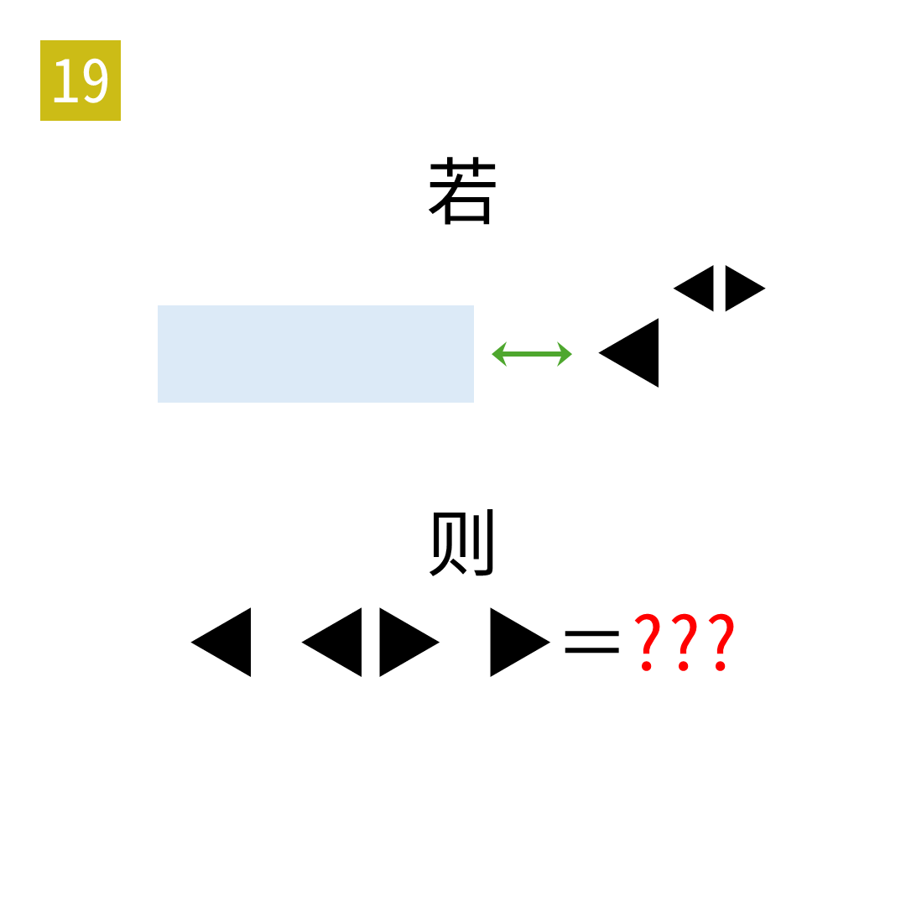

# 2025年度解谜能力测试 第 19 题

## 题面

## 答案

`BYE`

## 解析

蓝色背景为06中的33455432，绿色箭头是09中的交换第三位和第五位。应用变换得到33554432，等于2的25次方。最后A1Z26提取。

## 本地附件

- [38679b877e2f48868cef47865234a8a2.webp](../../../assets/static.cipherpuzzles.com/static/images/38679b877e2f48868cef47865234a8a2.webp)

来源：[https://ccbc16.cipherpuzzles.com/data/puzzle_script/c16-puzzle-solving-test.js#19](https://ccbc16.cipherpuzzles.com/data/puzzle_script/c16-puzzle-solving-test.js#19)
